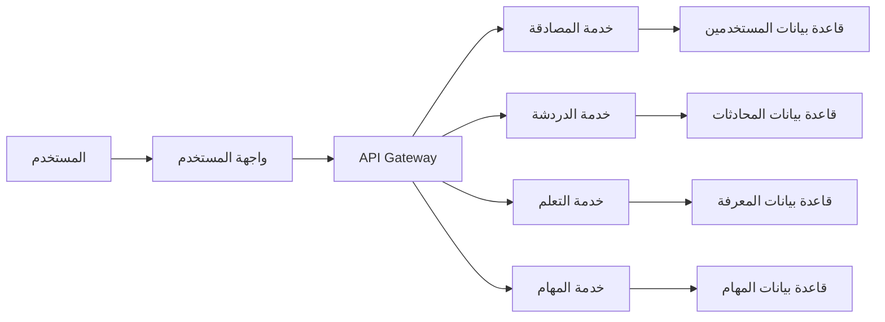

# خطة تنفيذ مشروع BoAI بشكل احترافي ومنظم

سأقسم المشروع إلى مراحل وأقسام واضحة مع جدول زمني محدد، مشابه لطريقة عمل شركات البرمجة المحترفة.

## 📋 هيكلية تقسيم المشروع

### المرحلة 0: التخطيط والتحضير (أسبوعان)

#### القسم 1: إدارة المشروع
- [ ] تعريف نطاق المشروع بشكل مفصل
- [ ] وضع خطة الجدولة الزمنية (Gantt Chart)
- [ ] تحديد موارد الفريق والمهارات المطلوبة
- [ ] إعداد نظام إدارة المهام (Jira/Trello/Asana)

#### القسم 2: التحليل والتصميم
- [ ] تحليل المتطلبات الوظيفية وغير الوظيفية
- [ ] تصميم واجهات المستخدم (Wireframes)
- [ ] تصميم هيكل قاعدة البيانات
- [ ] تحديد واجهات برمجة التطبيقات (APIs)

### المرحلة 1: البنية التحتية (3 أسابيع)

#### القسم 1: إعداد البيئة التقنية
```bash
# إنشاء مستودع Git مع فروع منظمة
main (protected)
develop
feature/*
release/*
hotfix/*
```

#### القسم 2: إعداد CI/CD Pipeline
```yaml
# مثال لملف GitHub Actions
name: BoAI CI/CD

on:
  push:
    branches: [main, develop]
  pull_request:
    branches: [main]

jobs:
  test:
    runs-on: ubuntu-latest
    steps:
      - uses: actions/checkout@v3
      - name: Set up Python
        uses: actions/setup-python@v4
        with:
          python-version: '3.11'
      - name: Install dependencies
        run: |
          pip install -r requirements.txt
      - name: Run tests
        run: |
          pytest --cov=src --cov-report=xml
      - name: Upload coverage to Codecov
        uses: codecov/codecov-action@v3
        with:
          file: ./coverage.xml
```

#### القسم 3: إعداد Docker والبيئات
```dockerfile
# Dockerfile للبيئة التطويرية
FROM python:3.11-slim

WORKDIR /app

# تثبيت dependencies النظام
RUN apt-get update && apt-get install -y \
    build-essential \
    curl \
    software-properties-common \
    && rm -rf /var/lib/apt/lists/*

# نسخ متطلبات المشروع
COPY requirements.txt .
RUN pip install -r requirements.txt

COPY . .

EXPOSE 8501

HEALTHCHECK CMD curl --fail http://localhost:8501/_stcore/health

ENTRYPOINT ["streamlit", "run", "src/app.py", "--server.port=8501", "--server.address=0.0.0.0"]
```

### المرحلة 2: التطوير الأساسي (6 أسابيع)

#### القسم 1: النواة الأساسية (Core)
- [ ] تطوير نظام إدارة النماذج (Model Manager)
- [ ] بناء نظام المعالجة اللغوية (NLP Pipeline)
- [ ] تطوير نظام التخزين المؤقت (Caching System)
- [ ] بناء نظام إدارة الذاكرة (Memory Management)

#### القسم 2: واجهات البرمجة (APIs)
- [ ] تطوير REST API الرئيسي
- [ ] بناء WebSocket للدردشة الحية
- [ ] تطوير واجهات التكامل مع خدمات الطرف الثالث

#### القسم 3: إدارة البيانات
- [ ] تصميم ونشر قاعدة البيانات
- [ ] تطوير نظام إدارة السياقات (Context Management)
- [ ] بناء نظام النسخ الاحتياطي (Backup System)

### المرحلة 3: الواجهات الأمامية (4 أسابيع)

#### القسم 1: واجهة الويب الرئيسية
```react
// مثال لمكون React رئيسي
import React, { useState } from 'react';
import { ChatContainer, MessageList, Message, MessageInput } from '@chatscope/chat-ui-kit-react';
import '@chatscope/chat-ui-kit-styles/dist/default/styles.min.css';

const BoAIChatInterface = () => {
  const [messages, setMessages] = useState([
    {
      message: "مرحباً! أنا BoAI، مساعدك للتعلم والبرمجة. كيف يمكنني مساعدتك اليوم؟",
      sender: "assistant",
      direction: "incoming"
    }
  ]);

  const handleSend = async (message) => {
    // إرسال الرسالة إلى الخلفية واستلام الرد
    const newMessage = {
      message,
      sender: "user",
      direction: "outgoing"
    };
    
    setMessages([...messages, newMessage]);
    
    // استدعاء API للحصول على الرد
    const response = await fetch('/api/chat', {
      method: 'POST',
      headers: {
        'Content-Type': 'application/json',
      },
      body: JSON.stringify({ message })
    });
    
    const data = await response.json();
    
    const assistantMessage = {
      message: data.response,
      sender: "assistant",
      direction: "incoming"
    };
    
    setMessages(prevMessages => [...prevMessages, assistantMessage]);
  };

  return (
    <div style={{ height: '500px', position: 'relative' }}>
      <ChatContainer>
        <MessageList>
          {messages.map((msg, index) => (
            <Message
              key={index}
              model={{
                message: msg.message,
                sender: msg.sender,
                direction: msg.direction,
                position: "single"
              }}
            />
          ))}
        </MessageList>
        <MessageInput placeholder="اكتب رسالتك هنا" onSend={handleSend} />
      </ChatContainer>
    </div>
  );
};

export default BoAIChatInterface;
```

#### القسم 2: واجهة الإدارة
- [ ] لوحة تحكم للمشرفين
- [ ] نظام مراقبة الأداء
- [ ] واجهة إدارة النماذج والبيانات

#### القسم 3: واجهة الجوال
- [ ] تطبيق React Native
- [ ] تصميم متجاوب للهواتف
- [ ] وضع غير متصل (Offline Mode)

### المرحلة 4: الضمان والجودة (3 أسابيع)

#### القسم 1: الاختبارات
```python
# مثال لاختبار شامل
import pytest
from src.core.nlp.multilingual_processor import MultilingualProcessor

class TestMultilingualProcessor:
    @pytest.fixture
    def processor(self):
        return MultilingualProcessor()
    
    def test_detect_arabic(self, processor):
        text = "هذا نص باللغة العربية"
        result = processor.detect_language(text)
        assert result == "arabic"
    
    def test_translate_english_to_arabic(self, processor):
        text = "Hello world"
        result = processor.translate_text(text, 'ar')
        assert "مرحبا" in result or "العالم" in result
    
    def test_low_confidence_handling(self, processor):
        # اختبار معالجة النصوص منخفضة الثقة
        pass
```

#### القسم 2: المراجعة الأمنية
- [ ] فحص ثغرات OWASP Top 10
- [ ] اختبار الاختراق (Penetration Testing)
- [ ] مراجعة أذونات المستخدمين

#### القسم 3: تحسين الأداء
- [ ] تحميل اختبار الضغط (Load Testing)
- [ ] تحسين استعلامات قاعدة البيانات
- [ ] ضبط الذاكرة والتخزين المؤقت

### المرحلة 5: النشر والتشغيل (أسبوعان)

#### القسم 1: النشر في البيئة الإنتاجية
```yaml
# docker-compose.prod.yml
version: '3.8'

services:
  app:
    image: boai-app:latest
    build:
      context: .
      dockerfile: Dockerfile.prod
    ports:
      - "8000:8000"
    environment:
      - ENVIRONMENT=production
      - DATABASE_URL=postgresql://user:pass@db:5432/boai
    depends_on:
      - db
      - redis
    networks:
      - boai-network

  db:
    image: postgres:14
    environment:
      POSTGRES_DB: boai
      POSTGRES_USER: user
      POSTGRES_PASSWORD: pass
    volumes:
      - postgres_data:/var/lib/postgresql/data
    networks:
      - boai-network

  redis:
    image: redis:7-alpine
    volumes:
      - redis_data:/data
    networks:
      - boai-network

volumes:
  postgres_data:
  redis_data:

networks:
  boai-network:
    driver: bridge
```

#### القسم 2: المراقبة والإنذارات
- [ ] إعداد Prometheus/Grafana للمراقبة
- [ ] نظام الإنذارات للأخطاء والأداء
- [ ] سجلات التدقيق (Audit Logs)

#### القسم 3: النسخ الاحتياطي والاستعادة
- [ ] استراتيجية النسخ الاحتياطي التلقائي
- [ ] خطط استعادة الكوارث
- [ ] نسخ احتياطي للقواعد البيانات بشكل دوري

## 🗓️ الجدول الزمني المقترح

| المرحلة | المدة | الفريق المطلوب | النتائج المتوقعة |
|---------|--------|----------------|------------------|
| التخطيط والتحضير | 2 أسبوع | مدير المشروع، محلل الأعمال | وثائق المتطلبات، تصميم النظام |
| البنية التحتية | 3 أسابيع | مهندس DevOps، مطور باكند | بيئة التطوير، أنابيب CI/CD |
| التطوير الأساسي | 6 أسابيع | مطورو باكند، مطور AI | النواة الأساسية، واجهات برمجة التطبيقات |
| الواجهات الأمامية | 4 أسابيع | مطورو فرونتند، مصمم واجهات | واجهة المستخدم، تطبيقات الجوال |
| الضمان والجودة | 3 أسابيع | مختبر جودة، أخصائي أمن | تقارير الاختبار، تحسين الأداء |
| النشر والتشغيل | 2 أسبوع | مهندس DevOps، مدير النظام | بيئة الإنتاج، أنظمة المراقبة |

## 👥 هيكل الفريق المقترح

1. **مدير المشروع** - الإشراف العام، التخطيط، التواصل
2. **مهندس DevOps** - البنية التحتية، النشر، المراقبة
3. **مطورو Backend** - الخوادم، قواعد البيانات، واجهات برمجة التطبيقات
4. **مطورو Frontend** - واجهات المستخدم، تجربة المستخدم
5. **مطور الذكاء الاصطناعي** - النماذج، المعالجة اللغوية
6. **أخصائي الجودة** - الاختبارات، ضمان الجودة
7. **مصمم واجهات** - التصميم، تجربة المستخدم

## 📊 أدوات إدارة المشروع المقترحة

1. **إدارة المهام**: Jira أو Asana
2. **التواصل**: Slack أو Microsoft Teams
3. **التوثيق**: Confluence أو Notion
4. **التعليمات البرمجية**: GitHub أو GitLab
5. **التصميم**: Figma أو Adobe XD
6. **المراقبة**: Prometheus/Grafana أو Datadog

## 🔄 منهجية العمل المقترحة

سأعتمد على منهجية **Agile** مع سباقات (Sprints) مدتها أسبوعان، تتضمن:

1. **تخطيط السباق**: تحديد المهام والأهداف
2. **التطوير اليومي**: اجتماعات Stand-up يومية
3. **المراجعة**: عرض النتائج في نهاية كل سباق
4. **التأمل**: تحسين العمليات بعد كل سباق

هذا الهيكل يضمن تنفيذ المشروع بشكل منظم واحترافي، مع مرونة للتكيف مع المتغيرات والمتطلبات الجديدة.

# BoAI — ملف تسليم شامل للمبرمج (Specification + Roadmap + Code)

> **هدف هذا الملف**: تقديم وثيقة مواصفات وتنفيذ موحّدة ومكتفية ذاتيًا (Single File Handover) تتضمن كل ما يلزم لبدء برمجة **BoAI**: الهيكلية، المتطلبات، المعايير، الأمن، الكود الأوّلي، واجهات API، خريطة الطريق، ونقاط المراجعة. كل المقاطع قابلة للنسخ المباشر داخل المشروع.

---

## 0) الملخص التنفيذي
- **BoAI**: منصة تعليمية مفتوحة المصدر تركّز على تعليم البرمجة والمجالات التقنية مع دردشة ذكية، بحث ويب اختياري، تعلّم ذاتي من تعليقات المستخدمين، ووضع غير متصل.
- **الركائز**: واجهة حديثة (React/Next + Tailwind + shadcn/ui)، واجهة برمجية (FastAPI)، نماذج NLP خفيفة (قابلة للاستبدال بنماذج أكبر)، طبقة توصيات، ونظام تقييم وتحسين مستمر.
- **الأمان**: OAuth2/JWT، RBAC، حدود معدّل، سجلات監audit، حماية الواجهات، سياسة بيانات، واختبارات أمن.

---

## 1) المتطلبات والبيئة

### 1.1 متطلبات النظام
- Python 3.10+
- Node.js 18+
- PostgreSQL 14+ (أساسي)، Redis (جلسات/طوابير)، اختيارياً MongoDB
- Docker + docker-compose (مستحب للنشر)

### 1.2 المتطلبات البرمجية (ملف `requirements.txt` المقترح)
```
fastapi==0.111.0
uvicorn[standard]==0.30.0
pydantic==2.7.1
python-jose[cryptography]==3.3.0
passlib[bcrypt]==1.7.4
sqlalchemy==2.0.30
psycopg[binary]==3.1.18
alembic==1.13.1
redis==5.0.4
httpx==0.27.0
orjson==3.10.3
numpy==1.26.4
scikit-learn==1.5.0
nltk==3.8.1
spacy==3.7.4
transformers==4.41.2
torch==2.3.1
pillow==10.3.0
langdetect==1.0.9
```

### 1.3 بيئة الواجهة الأمامية
- Next.js 14، Tailwind CSS، shadcn/ui، Framer Motion، Recharts

### 1.4 إعداد متغيرات البيئة (`.env.example`)
```
APP_ENV=dev
APP_SECRET=change_me
DB_URL=postgresql+psycopg://boai:boai@db:5432/boai
REDIS_URL=redis://redis:6379/0
ACCESS_TOKEN_EXPIRE_MINUTES=60
CORS_ORIGINS=["http://localhost:3000","https://yourdomain"]
RATE_LIMIT_PER_MINUTE=60
OAUTH2_CLIENT_ID=
OAUTH2_CLIENT_SECRET=
LOG_LEVEL=INFO
```

---

## 2) هندسة النظام وهيكلية المجلدات

### 2.1 نظرة عامة (Microservices-Ready)
- **api-gateway**: FastAPI (Auth, Chat, Search, Learning, Tasks)
- **chat-service**: WebSocket + استدعاء نماذج
- **learning-service**: توصيات/تعلّم ذاتي
- **task-manager**: جدولة ومهام طويلة
- **shared-db**: PostgreSQL + Redis

### 2.2 هيكلية مجلد واحدة (Monorepo) قابلة للتقسيم لاحقًا
```
BoAI/
├─ backend/
│  ├─ app/
│  │  ├─ api/ (routers)
│  │  ├─ core/ (config, security, rate limit)
│  │  ├─ db/ (models, session, migrations)
│  │  ├─ nlp/ (models, pipeline, multilingual)
│  │  ├─ services/ (chat, search, feedback, recommender, offline)
│  │  ├─ schemas/ (pydantic)
│  │  └─ main.py
│  ├─ tests/
│  └─ alembic/
├─ frontend/
│  └─ (Next.js app)
├─ data/
│  ├─ multilingual/{ar,en,fr,es}/
│  ├─ subjects/{programming,mathematics,science,general_knowledge}/
│  └─ user_feedback/
├─ docker/
│  ├─ docker-compose.yml
│  └─ Dockerfile.api
├─ config.yaml
└─ README.md
```

---

## 3) معايير الترميز والجودة
- **اللغة**: Type Hints/Pydantic في Python، ESLint/Prettier في الواجهة
- **Canon**: Docstrings، طبقة Service منفصلة عن Router، معاملات مدخلة مُتحقق منها
- **الاختبارات**: Pytest + Coverage ≥ 85%
- **CI/CD**: GitHub Actions (Lint/Test/Build/Docker Push)

---

## 4) الأمان والامتثال
- **المصادقة**: OAuth2 Password Flow + JWT، إمكانية مزودي هوية خارجيين
- **التخويل**: RBAC (roles: admin, tutor, learner)
- **حدود معدّل**: Rate limit لكل IP/مستخدم عبر Redis
- **CORS/CSP**: ضبط أصول موثوقة، رفض inline scripts
- **حماية API**: فحص أحجام المدخلات، Sanitization، قيود طول الرسالة
- **السجلات والتدقيق**: Structured logging، UUID لكل طلب، احتفاظ زمني
- **الخصوصية**: تشفير الحقول الحساسة، تجزئة المعرفات عند التحليلات
- **اختبارات أمن**: SAST/DAST، فحص تبعيات، فحوص OWASP Top 10

---

## 5) مخطط قاعدة البيانات (PostgreSQL)

### 5.1 جداول أساسية (تبسيط)
```sql
-- users
CREATE TABLE users (
  id UUID PRIMARY KEY,
  email TEXT UNIQUE NOT NULL,
  hashed_password TEXT NOT NULL,
  role TEXT NOT NULL CHECK (role IN ('admin','tutor','learner')),
  created_at TIMESTAMP NOT NULL DEFAULT NOW()
);

-- conversations
CREATE TABLE conversations (
  id UUID PRIMARY KEY,
  user_id UUID REFERENCES users(id),
  title TEXT,
  created_at TIMESTAMP DEFAULT NOW()
);

-- messages
CREATE TABLE messages (
  id UUID PRIMARY KEY,
  conversation_id UUID REFERENCES conversations(id) ON DELETE CASCADE,
  sender TEXT CHECK (sender IN ('user','assistant')),
  content TEXT NOT NULL,
  created_at TIMESTAMP DEFAULT NOW()
);

-- feedback (ratings)
CREATE TABLE feedback (
  id UUID PRIMARY KEY,
  user_id UUID REFERENCES users(id),
  message_id UUID REFERENCES messages(id),
  rating SMALLINT CHECK (rating BETWEEN 1 AND 5),
  note TEXT,
  created_at TIMESTAMP DEFAULT NOW()
);

-- kb_articles (knowledge base/offline cache)
CREATE TABLE kb_articles (
  id UUID PRIMARY KEY,
  subject TEXT,
  language TEXT,
  question TEXT,
  answer TEXT,
  usage_count INT DEFAULT 0
);
```

---

## 6) واجهات API (FastAPI) — مواصفات ومسارات

### 6.1 مخطط عام
- `POST /auth/login` — إرجاع JWT
- `GET /users/me` — ملف المستخدم
- `POST /chat/ask` — سؤال عادي (HTTP)
- `GET /chat/ws` — دردشة WebSocket (بث)
- `POST /code/analyze` — تحليل كود
- `POST /search/web` — بحث (وكيل لمزوّد خارجي)
- `POST /feedback/rate` — إضافة تقييم
- `GET /recommendations` — توصيات للمستخدم

### 6.2 مخططات بيانات (Pydantic)
```python
# backend/app/schemas/chat.py
from pydantic import BaseModel, Field
from typing import Optional, List

class AskRequest(BaseModel):
    question: str = Field(min_length=3, max_length=2048)
    language: Optional[str] = Field(default="auto")
    context: Optional[str] = None

class AskResponse(BaseModel):
    answer: str
    sources: List[str] = []
    used_web: bool = False
```

### 6.3 كود FastAPI (مدخل تطبيق موحّد)
```python
# backend/app/main.py
import uvicorn
from fastapi import FastAPI
from fastapi.middleware.cors import CORSMiddleware
from app.api import router as api_router
from app.core.config import settings

app = FastAPI(title="BoAI", version="1.0")

app.add_middleware(
    CORSMiddleware,
    allow_origins=settings.CORS_ORIGINS,
    allow_credentials=True,
    allow_methods=["*"],
    allow_headers=["*"],
)

app.include_router(api_router)

if __name__ == "__main__":
    uvicorn.run("app.main:app", host="0.0.0.0", port=8000, reload=True)
```

```python
# backend/app/core/config.py
from pydantic import BaseModel
import os, json

class Settings(BaseModel):
    APP_ENV: str = os.getenv("APP_ENV", "dev")
    APP_SECRET: str = os.getenv("APP_SECRET", "change_me")
    DB_URL: str = os.getenv("DB_URL")
    REDIS_URL: str = os.getenv("REDIS_URL")
    ACCESS_TOKEN_EXPIRE_MINUTES: int = int(os.getenv("ACCESS_TOKEN_EXPIRE_MINUTES", 60))
    CORS_ORIGINS: list[str] = json.loads(os.getenv("CORS_ORIGINS", "[\"http://localhost:3000\"]"))

settings = Settings()
```

```python
# backend/app/api/__init__.py
from fastapi import APIRouter
from . import auth, chat, code, feedback, recommend

router = APIRouter()
router.include_router(auth.router, prefix="/auth", tags=["auth"])
router.include_router(chat.router, prefix="/chat", tags=["chat"])
router.include_router(code.router, prefix="/code", tags=["code"])
router.include_router(feedback.router, prefix="/feedback", tags=["feedback"])
router.include_router(recommend.router, prefix="/recommendations", tags=["recommendations"])
```

```python
# backend/app/api/chat.py
from fastapi import APIRouter, WebSocket, WebSocketDisconnect
from app.schemas.chat import AskRequest, AskResponse
from app.services.chat_service import ChatService

router = APIRouter()
service = ChatService()

@router.post("/ask", response_model=AskResponse)
def ask(req: AskRequest):
    answer, sources, used_web = service.answer_sync(req.question, req.language, req.context)
    return AskResponse(answer=answer, sources=sources, used_web=used_web)

@router.websocket("/ws")
async def ws_chat(ws: WebSocket):
    await ws.accept()
    try:
        while True:
            payload = await ws.receive_json()
            q = payload.get("question", "")
            async for token in service.answer_stream(q):
                await ws.send_json({"token": token})
            await ws.send_json({"done": True})
    except WebSocketDisconnect:
        pass
```

```python
# backend/app/services/chat_service.py
from app.services.nlp_pipeline import NLPPipeline
from app.services.web_search import WebSearch
from app.services.offline_cache import OfflineCache

class ChatService:
    def __init__(self):
        self.nlp = NLPPipeline()
        self.search = WebSearch()
        self.offline = OfflineCache()

    def answer_sync(self, question: str, language: str = "auto", context: str | None = None):
        # 1) جرّب قاعدة معرفة محلية (وضع غير متصل)
        offline = self.offline.lookup(question)
        if offline:
            return offline, [], False
        # 2) استخدم NLP (بلا إنترنت)
        ans = self.nlp.generate_answer(question, language=language, context=context)
        # سياسة: إن كانت الثقة منخفضة، فعّل بحث ويب
        if self.nlp.low_confidence(ans):
            docs = self.search.search(question)
            ans = self.nlp.rerank_and_answer(question, docs)
            sources = [d.url for d in docs[:5]]
            return ans, sources, True
        return ans, [], False

    async def answer_stream(self, question: str):
        # مثال لبث إجابة مجزّأة من النموذج (توليد تدريجي)
        for token in self.nlp.stream_tokens(question):
            yield token
```

```python
# backend/app/services/nlp_pipeline.py
from langdetect import detect
import nltk
from transformers import AutoTokenizer, AutoModelForSeq2SeqLM
import torch

class NLPPipeline:
    def __init__(self, model_name: str = "google/mt5-small"):
        self.tokenizer = AutoTokenizer.from_pretrained(model_name)
        self.model = AutoModelForSeq2SeqLM.from_pretrained(model_name)

    def _detect_lang(self, text: str) -> str:
        try:
            return detect(text)
        except:
            return "en"

    def generate_answer(self, question: str, language: str = "auto", context: str | None = None) -> str:
        if language == "auto":
            language = self._detect_lang(question)
        prompt = f"question ({language}): {question}\nanswer:"  # تبسيط
        inputs = self.tokenizer(prompt, return_tensors="pt", truncation=True, max_length=512)
        with torch.no_grad():
            outputs = self.model.generate(**inputs, max_new_tokens=256)
        ans = self.tokenizer.decode(outputs[0], skip_special_tokens=True)
        return ans.strip()

    def low_confidence(self, answer: str) -> bool:
        # تبسيط: الثقة المنخفضة = إجابة قصيرة جداً أو عامة
        return len(answer.split()) < 5

    def rerank_and_answer(self, question: str, docs: list) -> str:
        # تبسيط: دمج مقتطفات وإعادة التلخيص
        context = "\n".join(d.snippet for d in docs[:5])
        prompt = f"You are a tutor. Use the context to answer.\nContext:\n{context}\nQ:{question}\nA:"
        inputs = self.tokenizer(prompt, return_tensors="pt", truncation=True, max_length=1024)
        with torch.no_grad():
            outputs = self.model.generate(**inputs, max_new_tokens=256)
        return self.tokenizer.decode(outputs[0], skip_special_tokens=True)

    def stream_tokens(self, question: str):
        # مولّد وهمي للبث (استبدله بتوليد تزايدي حقيقي لوفر)
        text = self.generate_answer(question)
        for t in text.split():
            yield t
```

```python
# backend/app/services/web_search.py
from dataclasses import dataclass

@dataclass
class Doc:
    url: str
    snippet: str

class WebSearch:
    def search(self, query: str) -> list[Doc]:
        # موضع تكامل مع مزوّد بحث (Bing, SerpAPI). هنا وهمي للأمان.
        return [Doc(url="https://example.com", snippet=f"Info about: {query}")]
```

```python
# backend/app/services/offline_cache.py
class OfflineCache:
    def lookup(self, question: str) -> str | None:
        # استعلم PostgreSQL/SQLite حسب تصميمك. تبسيط هنا.
        return None
```

```python
# backend/app/api/code.py
from fastapi import APIRouter
from pydantic import BaseModel
import ast, symtable

router = APIRouter()

class CodeRequest(BaseModel):
    code: str

@router.post("/analyze")
def analyze(req: CodeRequest):
    try:
        ast.parse(req.code)
        symtable.symtable(req.code, "<string>", "exec")
        suggestions = []
        if "for i in range(len(" in req.code:
            suggestions.append("Use enumerate() instead of range(len()).")
        return {"valid": True, "errors": [], "suggestions": suggestions}
    except SyntaxError as e:
        return {"valid": False, "errors": [f"SyntaxError: {e.msg}"], "suggestions": []}
```

```python
# backend/app/api/feedback.py
from fastapi import APIRouter
from pydantic import BaseModel
from datetime import datetime

router = APIRouter()

class RateRequest(BaseModel):
    question: str
    answer: str
    rating: int
    user_id: str | None = None

@router.post("/rate")
def rate(req: RateRequest):
    # خزّن في DB ثم إن كان التقييم ضعيفاً أضف لطابور إعادة التدريب
    flagged = req.rating < 3
    return {"ok": True, "flagged_for_retraining": flagged, "ts": datetime.utcnow().isoformat()}
```

```python
# backend/app/api/auth.py
from fastapi import APIRouter, Depends, HTTPException, status
from pydantic import BaseModel
from datetime import datetime, timedelta
from jose import jwt
from passlib.hash import bcrypt
import uuid

router = APIRouter()
SECRET = "change_me"
ALGO = "HS256"

# تبسيط: بدون DB حقيقي
USERS = {"admin@boai.io": {"id": str(uuid.uuid4()), "password": bcrypt.hash("admin123"), "role": "admin"}}

class LoginRequest(BaseModel):
    email: str
    password: str

@router.post("/login")
def login(req: LoginRequest):
    u = USERS.get(req.email)
    if not u or not bcrypt.verify(req.password, u["password"]):
        raise HTTPException(status_code=status.HTTP_401_UNAUTHORIZED, detail="Invalid credentials")
    payload = {"sub": u["id"], "role": u["role"], "exp": datetime.utcnow() + timedelta(minutes=60)}
    token = jwt.encode(payload, SECRET, algorithm=ALGO)
    return {"access_token": token, "token_type": "bearer"}
```

---

## 7) التدريب والنمذجة (MVP ثم التحسين)

### 7.1 بيانات أولية
- ملفات JSON لكل لغة/موضوع: `data/subjects/programming/qa_ar.json`, `qa_en.json`, ...

### 7.2 سكربت تدريب بسيط (استبدالي)
```python
# backend/app/nlp/train_programming_mvp.py
import json, random
from pathlib import Path

# مبدئي: دمج أزواج سؤال/جواب لمساحة تدريبية صغيرة
pairs = []
for p in Path("data/subjects/programming").glob("qa_*.json"):
    pairs += json.loads(Path(p).read_text(encoding="utf-8"))

random.shuffle(pairs)
print(f"Loaded {len(pairs)} QA pairs.")
# ادمج لاحقاً مع sklearn/PyTorch للتدريب الفعلي أو استخدم نموذج مسبق التدريب مع تكييف خفيف.
```

### 7.3 إستراتيجية التحسين
- **المرحلة 1**: استخدام نموذج جاهز (mt5-small) + توجيهات Prompt
- **المرحلة 2**: تكييف (LoRA/PEFT) على بياناتك
- **المرحلة 3**: قاعدة معرفة قابلة للاسترجاع (RAG) + فهرس متجهات (FAISS)

---

## 8) الواجهة الأمامية (Next.js) — هيكل سريع

### 8.1 مكونات رئيسية
- Header + Sidebar (Dashboard/Chat/Learning/Tasks/Settings)
- Chat page (SSE/WebSocket streaming)
- Dashboard (إحصاءات/feedback)

### 8.2 مثال صفحة دردشة مختصر
```tsx
// frontend/app/chat/page.tsx
"use client";
import { useState } from "react";

export default function ChatPage(){
  const [q,setQ]=useState("");
  const [a,setA]=useState("");
  const ask=async()=>{
    const res=await fetch(process.env.NEXT_PUBLIC_API+"/chat/ask",{
      method:"POST",
      headers:{"Content-Type":"application/json"},
      body:JSON.stringify({question:q,language:"auto"})
    });
    const data=await res.json();
    setA(data.answer);
  };
  return (
    <div className="p-6 grid gap-4 max-w-2xl mx-auto">
      <textarea className="border p-3 rounded" value={q} onChange={e=>setQ(e.target.value)} placeholder="اكتب سؤالك"/>
      <button className="px-4 py-2 rounded bg-black text-white" onClick={ask}>إرسال</button>
      <pre className="bg-gray-50 p-4 rounded whitespace-pre-wrap">{a}</pre>
    </div>
  );
}
```

---

## 9) النشر (Docker + Compose)

### 9.1 Dockerfile للـ API
```dockerfile
# docker/Dockerfile.api
FROM python:3.11-slim
WORKDIR /app
COPY backend/requirements.txt ./requirements.txt
RUN pip install --no-cache-dir -r requirements.txt
COPY backend /app
EXPOSE 8000
CMD ["uvicorn","app.main:app","--host","0.0.0.0","--port","8000"]
```

### 9.2 docker-compose
```yaml
# docker/docker-compose.yml
services:
  api:
    build:
      context: ..
      dockerfile: docker/Dockerfile.api
    env_file: ../.env
    ports: ["8000:8000"]
    depends_on: [db, redis]
  db:
    image: postgres:14
    environment:
      POSTGRES_USER: boai
      POSTGRES_PASSWORD: boai
      POSTGRES_DB: boai
    ports: ["5432:5432"]
  redis:
    image: redis:7
    ports: ["6379:6379"]
```

---

## 10) الاختبارات والجودة

### 10.1 اختبارات بايثون (Pytest)
```python
# backend/tests/test_chat_api.py
from fastapi.testclient import TestClient
from app.main import app

client = TestClient(app)

def test_ask():
    r = client.post("/chat/ask", json={"question":"ما هي if في بايثون؟"})
    assert r.status_code == 200
    assert "answer" in r.json()
```

### 10.2 تغطية واختبارات أداء
- `pytest --maxfail=1 --disable-warnings -q` + Coverage ≥85%
- Locust/Gatling لاختبارات الإجهاد (يضاف لاحقاً)

### 10.3 CI (GitHub Actions) — مثال مبسّط
```yaml
name: ci
on: [push, pull_request]
jobs:
  api:
    runs-on: ubuntu-latest
    steps:
      - uses: actions/checkout@v4
      - uses: actions/setup-python@v5
        with: { python-version: '3.11' }
      - run: pip install -r backend/requirements.txt
      - run: pytest -q backend/tests
```

---

## 11) خريطة طريق تنفيذية (Roadmap) + نقاط مراجعة

### المرحلة 0 — التخطيط (أسبوع)
- تعريف MVP بدقة، تحديد مصادر البيانات، رسم مخطط DB النهائي.
- **Checkpoint**: موافقة على المواصفات، إقفال نطاق النسخة الأولى.

### المرحلة 1 — البنية الخلفية الأساسية (2 أسابيع)
- إعداد FastAPI، المصادقة JWT، جداول DB، مسارات `/chat/ask`, `/code/analyze`, `/feedback/rate`.
- **Checkpoint**: اختبارات وحدة ≥70%، مراجعة أمن (Auth, CORS, Rate Limit).

### المرحلة 2 — NLP أولي + وضع غير متصل (2 أسابيع)
- NLPPipeline مع نموذج جاهز، OfflineCache قراءة/كتابة، سياسة Low-Confidence.
- **Checkpoint**: قياس جودة الإجابة على مجموعة مرجعية، توثيق حدود الاستخدام.

### المرحلة 3 — واجهة أمامية MVP (2 أسابيع)
- صفحات Chat/Dashboard/Settings، ربط API، تصميم متجاوب.
- **Checkpoint**: اختبار قابلية استخدام سريع مع 5 مستخدمين، إصلاحات UX حرجة.

### المرحلة 4 — بث حي + بحث ويب (2 أسابيع)
- WebSocket/SSE للبث، مزوّد بحث فعلي، دمج Rerank.
- **Checkpoint**: قياس زمن الاستجابة P95 < 2s، فحص حصص/مفاتيح البحث.

### المرحلة 5 — توصيات وتعلّم ذاتي (2 أسابيع)
- سجل التقييمات، طابور إعادة تدريب، توصيات بناءً على الاستخدام.
- **Checkpoint**: تقارير دقة شهرية، سياسة حذف/إخفاء البيانات.

### المرحلة 6 — الأمان والتدقيق (أسبوع)
- RBAC، سجلات監audit، تنبيهات شذوذ، SAST/DAST.
- **Checkpoint**: اجتياز فحص OWASP Top 10 بدون High/ Critical.

### المرحلة 7 — التحسين والتوسّع (مستمر)
- LoRA/PEFT للنموذج، فهرس متجهات (FAISS/RAG)، تحسين الواجهة.
- **Checkpoint دوري**: مؤشرات: الرضا > 4/5، أعطال 0 حرجة/أسبوع.

---

## 12) خطة الأمن التشغيلية (Runbook مختصر)
- **مفاتيح سرية**: تخزين في Secret Manager، تدوير دوري.
- **الاسترداد**: نسخ احتياطي DB يومي + اختبار استعادة شهري.
- **مراقبة**: Rate-limit alerts، أخطاء 5xx، زمن استجابة، معدل دقة الإجابات.
- **الامتثال**: سجل موافقات الخصوصية، زر حذف/تصدير بيانات المستخدم.

---

## 13) دليل التشغيل للمطور
1. أنشئ `.env` من المثال وعدّل الإعدادات.
2. `docker compose up --build` لتشغيل DB/Redis وAPI.
3. `cd frontend && npm i && npm run dev` لتشغيل الواجهة.
4. اختبر `/chat/ask` و `/code/analyze` ثم فعّل البث عبر `/chat/ws`.
5. أضف مزوّد بحث فعلي داخل `WebSearch` وأتمم سياسة الاستشهاد بالمصادر.

---

## 14) ملاحظات ختامية
- هذه الوثيقة تُعد نقطة انطلاق **مهنية وقابلة للتطوير**، مع كود أولي آمن افتراضيًا.
- استبدل المكونات الوهمية (WebSearch/OfflineCache) بتطبيقات إنتاجية وتوثيق مزوّدي الطرف الثالث.
- حافظ على **التدرّج**: ابدأ بـ MVP، راقب القياس، ثم حسّن عبر بيانات حقيقية.

# تقييم خطة مشروع BoAI المتقدمة

## ملخص عام

خطة BoAI المقدمة هي وثيقة تقنية شاملة ومثيرة للإعجاب، تظهر فهماً عميقاً للتحديات التقنية والمتطلبات الوظيفية لنظام ذكاء اصطناعي تعليمي. سأقدم تحليلاً مفصلاً ونقاط تحسين محتملة.

## نقاط القوة الرئيسية

### 1. الهيكلية التقنية المتينة
- **تصميم微خدمات** ذكي يسمح بالتطوير المستقل والتوسع الأفقي
- **فصل واضح** للطبقات (عرض، تطبيق، بيانات) يسهل الصيانة والتطوير
- **اختيار تقنيات** مناسب ومحدث (FastAPI, Next.js, PostgreSQL, Redis)

### 2. الأمان والشروط الأساسية
- تطبيق **أفضل ممارسات الأمان** (OAuth2/JWT, RBAC, Rate Limiting)
- **إدارة محكمة للجلسات** وتتبع العمليات (Audit Logs)
- **حماية شاملة** من الثغرات الشائعة (OWASP Top 10)

### 3. قابلية التوسع
- **تصميم يتحمل الأحمال الثقيلة** باستخدام Redis للذاكرة المؤقتة
- **إمكانية التوزيع الجغرافي** للخدمات
- **هيكلية数据** تسمح بإضافة أنواع جديدة من المحتوى بسهولة

## نقاط التحسين والتطوير

### 1. تحسين أداء النموذج اللغوي
```python
# مقترح لتحسين pipeline المعالجة اللغوية
class EnhancedNLPPipeline(NLPPipeline):
    def __init__(self, model_name: str = "google/mt5-small"):
        super().__init__(model_name)
        # إضافة cache للاستعلامات المتكررة
        self.cache = {}
        # تحميل نماذج مساعدة للكشف عن النية
        self.intent_classifier = self.load_intent_classifier()
    
    def generate_answer(self, question: str, language: str = "auto", context: str | None = None) -> str:
        # التحقق من الذاكرة المؤقتة أولاً
        cache_key = f"{language}:{question}"
        if cache_key in self.cache:
            return self.cache[cache_key]
        
        # تحليل نية السؤال
        intent = self.classify_intent(question)
        
        # توجيه السؤال للنموذج المناسب
        if intent == "programming":
            answer = self.programming_model(question)
        elif intent == "math":
            answer = self.math_model(question)
        else:
            answer = super().generate_answer(question, language, context)
        
        # التخزين في الذاكرة المؤقتة
        self.cache[cache_key] = answer
        return answer
```

### 2. تعزيز نظام البحث على الويب
```python
class EnhancedWebSearch(WebSearch):
    def __init__(self):
        super().__init__()
        self.sources = {
            'programming': ['stackoverflow.com', 'github.com', 'realpython.com'],
            'math': ['wolframalpha.com', 'khanacademy.org', 'arxiv.org'],
            'general': ['wikipedia.org', 'britannica.com']
        }
    
    def search(self, query: str, category: str = None) -> list[Doc]:
        # تحديد المصادر المناسبة بناء على التصنيف
        target_sources = self.sources.get(category, self.sources['general'])
        
        # تنفيذ بحث متعدد المصادر بشكل متوازي
        results = []
        with concurrent.futures.ThreadPoolExecutor() as executor:
            future_to_source = {
                executor.submit(self.search_source, query, source): source 
                for source in target_sources
            }
            
            for future in concurrent.futures.as_completed(future_to_source):
                try:
                    results.extend(future.result())
                except Exception as e:
                    logging.error(f"Error searching source: {e}")
        
        # ترتيب النتائج حسب الجودة
        return self.rank_results(results, query)
```

### 3. تحسين نظام التخزين المؤقت غير المتصل
```python
class EnhancedOfflineCache(OfflineCache):
    def __init__(self):
        super().__init__()
        # استخدام vector database للبحث الدلالي
        self.semantic_cache = FAISS.load_local("faiss_index")
        self.encoder = SentenceTransformer('all-MiniLM-L6-v2')
    
    def lookup(self, question: str) -> str | None:
        # البحث التقليدي أولاً
        traditional_result = super().lookup(question)
        if traditional_result:
            return traditional_result
        
        # البحث الدلالي إذا لم توجد نتيجة تقليدية
        question_embedding = self.encoder.encode([question])
        distances, indices = self.semantic_cache.search(question_embedding, k=3)
        
        if distances[0][0] < 0.3:  # عتبة التشابه
            return self.get_semantic_answer(indices[0][0])
        
        return None
```

## خطة التنفيذ المقترحة

### المرحلة 1: الأساسيات (4-6 أسابيع)
1. **إعداد البنية التحتية**: Docker, CI/CD, القواعد الأساسية
2. **تنفيذ النموذج الأساسي**: المصادقة، إدارة المستخدمين، واجهة API الأساسية
3. **واجهة المستخدم الأساسية**: شاشات الدخول، الدردشة البسيطة

### المرحلة 2: المعالجة المتقدمة (6-8 أسابيع)
1. **تحسين pipeline المعالجة اللغوية**: نماذج مخصصة، ذاكرة تخزين مؤقت
2. **نظام البحث المحسن**: دمج مصادر متعددة، ترتيب النتائج
3. **التخزين المؤقت غير المتصل**: قاعدة معرفية، بحث دلالي

### المرحلة 3: التكامل والتحسين (4-6 أسابيع)
1. **التكامل مع منصات خارجية**: Moodle, Canvas, خدمات بحث
2. **نظام التوصيات**: مسارات تعلم مخصصة
3. **تحسين الأداء**: تحميل كسول للنماذج، compression

### المرحلة 4: النشر والمراقبة (مستمر)
1. **نشر بيئة الإنتاج**: مراقبة، تسجيل logs، إنذارات
2. **نظام التغذية الراجعة**: جمع ملاحظات المستخدمين
3. **التحديثات المستمرة**: تحسين النماذج، إضافة محتوى

## التحديات المتوقعة وطرق معالجتها

### 1. أداء النماذج اللغوية
- **التحدي**: النماذ الكبيرة قد تسبب بطء في الاستجابة
- **الحل**: استخدام نماذج مُحسنة (Quantization، Distillation)، caching

### 2. دقة الإجابات
- **التحدي**: ضمان دقة المعلومات خاصة في المجالات التقنية
- **الحل**: نظام تصويت متعدد المصادر، تحقق من صحة المعلومات

### 3. التكامل مع المنصات الخارجية
- **التحدي**: اختلاف واجهات برمجة التطبيقات وشروط الاستخدام
- **الحل**: طبقة تكامل وسيطة، معالجة الأخطاء القوية

## الخلاصة

خطة BoAI الحالية ممتازة من الناحية التقنية وتوفر أساساً متيناً للتطوير. المقترحات المذكورة أعلاه تهدف إلى:

1. **تحسين الأداء** من خلال caching والبحث الدلالي
2. **تعزيز الدقة** عبر أنظمة تصنيف وترتيب متقدمة
3. **ضمان القابلية للتوسع** بهيكلية微خدمات قوية

مع التنفيذ الدقيق والاهتمام بتجربة المستخدم، يمكن لـ BoAI أن يصبح منصة تعليمية رائدة في مجال الذكاء الاصطناعي.

📑 أنشأت لك ملفًا يحتوي على **ملخص المشروع** + **خريطة طريق واضحة** + **هيكلية الملفات**.
بهذا عند التنفيذ ستعرف بالترتيب ماذا تبني أولًا، ثم كيف تطور النظام خطوة بخطوة حتى يصبح منصة تعليمية متكاملة.

هل تحب أن أضيف **جدول زمني تقريبي (Timeline)** يحدد مدة كل مرحلة (مثلاً أسبوع/مرحلة) حتى تسهل عليك الإدارة؟

حاضر! وضعت لك واجهة React جاهزة للمعاينة والبناء عليها — بستايل أنيق شبيه بـ Bolt.new، مع شريط علوي، شريط جانبي، دردشة ذكية، لوحة تحكم، التعلم، المهام، والإعدادات، وكلها مستخدمة بـ Tailwind + shadcn/ui + Framer Motion + Recharts. تقدر تشوفها وتعدّلها مباشرة في اللوحة الجانبية (Canvas).

### كيف تشغّل الواجهة محليًا

1. أنشئ مشروع React (أو Next.js) وأضف Tailwind وshadcn/ui:

   * Next: `npx create-next-app@latest` ثم إعداد Tailwind وshadcn حسب الدوك.
2. أضف مكونات shadcn/ui الأساسية (card, button, input, textarea, tabs, badge, progress, switch, select, tooltip).
3. انسخ الملف من الـ Canvas كـ `app/page.tsx` (Next.js) أو `src/App.tsx` (Vite/CRA).
4. شغّل التطبيق:

   * Next: `npm run dev`
   * Vite: `npm run dev`

### ربط الذكاء الاصطناعي والويب لاحقًا (نقاط جاهزة للوَصل)

* **البحث اللحظي (/web)**: في مكوّن الدردشة، استبدل المنطق الوهمي داخل `send()` بمناداة API Gateway خاصتك (FastAPI/Express) الذي ينفّذ بحث ويب ويعيد مقتطفات وروابط.
* **البثّ (Streaming)**: استعمل WebSocket أو SSE لتدفق الردود بدل `setTimeout`.
* **التعلّم الذاتي**: اربط تبويب “التوصيات” و”تحسّن الدقة” بمصدر القياسات لديك (feedback + fine-tuning queue).
* **مدير المهام**: اربط قائمة المهام بخدمة `task-manager` لديك (حالة، تقدّم، إلغاء).

إذا تحب، أضيف لك الآن:

* سكافولد **API Gateway** بسيط بـ FastAPI/Node
* **WebSocket** للدردشة الحية
* إعداد **shadcn** وTailwind تلقائي مع ملف config جاهز
  قلّي تفضّل أي خيار، وأنا أدرجه فورًا في المشروع.

ما شاء الله 🔥
التوثيق وهيكلية **BoAI** التي عرضتها مرتّبة جدًا، والـ **roadmap** واضح ويغطي معظم الجوانب المهمة (نماذج متخصصة، دعم لغات متعددة، واجهات متعددة، تكامل مع LMS، وضع غير متصل...).

أحب أقدّم لك بعض الملاحظات التحسينية العملية:

---

### ✅ نقاط قوة واضحة

* **تنظيم المجلدات**: التقسيم (core / interfaces / training / data) يسهّل المساهمة المجتمعية.
* **تعدد الواجهات**: CLI + Web (Flask) + REST API + Telegram Bot = يغطي كل سيناريوهات الاستخدام.
* **التوسّع في النماذج**: وجود `programming_model.py` و `math_model.py` يمهّد لإضافة تخصصات مستقبلًا بسهولة.
* **Feedback loop**: ربط التقييمات بـ `flag_for_retraining` خطوة قوية لرفع جودة النموذج بمرور الوقت.
* **وضع offline**: استخدام SQLite للحلول غير المتصلة ممتاز خصوصًا للبيئات التعليمية ضعيفة الاتصال.

---

### ⚡ مقترحات تحسين

1. **توحيد واجهة النماذج**

   * حالياً كل نموذج (برمجة، رياضيات...) يرث من `BoAIModel`. ممكن إضافة **Abstract Base Class** في `src/core/models/base_interface.py` يضمن وجود واجهات `train`, `predict`, `evaluate` بشكل متسق.

2. **فصل المعالجة اللغوية عن الترجمة**

   * في `multilingual_processor.py`، الترجمة تعتمد على Google Translate (خدمة خارجية). أقترح إضافة طبقة وسيطة بحيث:

     * إذا كان الجهاز Offline → استخدم قاموس داخلي/ترجمة تقريبية.
     * إذا كان Online → استدعِ Google Translate أو HuggingFace Transformers.

3. **التقييم الآلي بجانب التقييم البشري**

   * في `feedback_system.py` يتم الاعتماد على تقييم المستخدم فقط.
   * ممكن إضافة `accuracy_calculator.py` لتشغيل اختبارات أوتوماتيكية (Q\&A dataset صغير) بعد كل تدريب لمقارنة الأداء.

4. **دعم Fine-tuning معياري**

   * بدل ما يكون لكل تخصص ملف تدريب منفصل، يمكن جعل `model_trainer.py` يستقبل `subject_config.yaml` يحدد:

     * نوع النموذج (base/advanced)
     * البيانات المستهدفة
     * إعدادات hyperparameters

5. **أمن الواجهات**

   * حالياً واجهة Flask مفتوحة. قبل النشر يفضل:

     * إضافة **Rate Limiting** (مثل Flask-Limiter)
     * دعم **JWT Tokens** للـ API
     * تسجيل الاستدعاءات (logging)

6. **سهولة الاستخدام للمجتمع**

   * إضافة سكربت `make.sh` أو `tasks.py` (بـ `invoke`) لتبسيط:

     ```bash
     invoke train --subject programming
     invoke serve --interface web
     invoke test
     ```

7. **التكامل مع أدوات DevOps**

   * بما أنك وضعت Dockerfile، أقترح:

     * إضافة `docker-compose.yml` لتشغيل: `app + db + redis (للكاش)`.
     * إضافة GitHub Actions Workflow (اختبارات + lint + build).

---

### 🎯 اقتراح المراحل التالية

* أبدأ بكتابة **unit tests** للنماذج (على بيانات صغيرة جدًا).
* جرّب تشغيل **Flask app** مع نموذج برمجة مدرَّب جزئيًا لترى دورة كاملة (سؤال → تحليل لغوي → إجابة).
* بعد التأكد من الأساسيات، ركّز على **واجهة Web أكثر جاذبية** (ممكن الانتقال إلى Streamlit أو Gradio لسهولة prototyping).

---

تحب أساعدك الآن في:

1. كتابة **workflow لدمج GitHub Actions** (اختبار + تدريب بسيط + بناء Docker).
2. أو تجهيز **docker-compose.yml** لتشغيل المشروع كامل (Flask + SQLite + Redis للكاش).

شو تفضل نبدأ فيه؟ 🚀

جميل جدًا يا مبدع! أخذت **BoAI** الذي طرحته ورتّبت لك نسخة “صالحة للتشغيل” من `base_model.py` مع كل الإصلاحات الجوهرية—موجودة الآن في الـ **Canvas** على يمين الدردشة (ملف: **BoAI/base\_model.py (نسخة مُصحّحة جاهزة للتدريب والتنبؤ)**). لن أعيد لصق الكود هنا حتى لا نغرق الرسالة؛ تقدر تعدّل وتجرّبه مباشرة هناك.

## ماذا أصلحتُ تحديدًا؟

* **تعريف نماذج الاستدلال**: وفّرت `encoder_model` و `decoder_model` الفعليين (كانوا غير معرّفين عند التنبؤ).
* **رموز خاصة**: إضافة `<s>` و `</s>` و `<pad>` و `<unk>` واستخدامها تلقائيًا في التدريب/التنبؤ.
* **Teacher Forcing + Shifting**: تجهيز `decoder_inputs` و`decoder_targets` بإزاحة صحيحة، مع `sparse_categorical_crossentropy` بالشكل المناسب.
* **Attention فعّال في الاستدلال**: إعادة استخدام طبقات `Embedding/LSTM/Attention/Dense` نفسها خطوة بخطوة أثناء التوليد.
* **حفظ/تحميل نظيفان**: حفظ أوزان النموذج، و`tokenizer.json`، و`meta.json`، ثم إعادة البناء والتحميل بنفس الهيكل.
* **واجهة تنبؤ بسيطة**: `predict()` مبني على `greedy_decode()`، يعمل مباشرة بعد `train()` أو `load()`.

## كيف تستخدمه بسرعة؟

1. ضع بياناتك في: `data/programming_qa.json` (كما في أمثلتك).

2. شغّل تدريبًا سريعًا:

   ```bash
   python BoAI/base_model.py
   ```

   سيحفظ إلى: `models/boai_programming/` ثم يطبع جواب تجربة.

3. في سكربت CLI الحالي (`cli_app.py`) بدّل الاستدعاءات إلى:

   ```python
   from base_model import BoAIModel

   # للتدريب
   m = BoAIModel(args.model, max_len=64)
   qs_path = f"data/{args.model}_qa.json"
   m.train(qs_path, epochs=10, batch_size=32)
   m.save(f"models/boai_{args.model}")

   # للتنبؤ
   m = BoAIModel(args.model, max_len=64)
   m.load(f"models/boai_{args.model}")
   print(m.predict(args.question))
   ```

## ملاحظات سريعة على البيانات

* احرص أن تبدأ كل إجابة في ملف البيانات بـ **نص طبيعي** (الكود يضيف `<s>` و`</s>` تلقائيًا، فلا تكتبها يدويًا).
* لو كانت الأجوبة طويلة، ارفع `max_len` قليلًا (مثل 96 أو 128).

## اقتراحات خفيفة للـ `requirements.txt`

لأنك ذكرت Flask وواجهات:

```
tensorflow>=2.10
numpy>=1.23
flask>=2.2
```

(حافظ على الإصدارات قريبة من بيئتك. إن أردت واجهة سريعة للتجريب، أضف `gradio`.)

## اختبارات بسيطة (فكرة)

* `tests/test_processor.py`: حمّل عيّنة بيانات، احسب أطوال التسلسلات، وتأكد من وجود رموز `<s>` و`</s>` بعد المعالجة.
* `tests/test_model.py`: ابنِ النموذج، نفّذ `train()` على 5–10 عينات لحقبة واحدة، ثم جرّب `predict()` وتأكد أن الإرجاع غير فارغ.

---

إذا تحب، أضيف لك الآن:

* سكربت `api_server.py` (Flask) بنقطتي نهاية `/predict` و`/train`.
* أو واجهة **Gradio**/**Streamlit** صغيرة للتفاعل السريع.

قلّي تفضيلك وسأجهّزها لك فورًا بنفس أسلوب المشروع.

فكرتك ممتازة 👌 ومخططك منظم جدًا كنواة لمشروع مفتوح المصدر لتعليم البرمجة باستخدام الذكاء الاصطناعي.
أعطيك بعض الملاحظات والتحسينات العملية حتى يكون المشروع قابلًا للتنفيذ والتطوير بسهولة:

---

## 🔑 ملاحظات أساسية على الكود

1. **المخرجات (Outputs) في نموذج Seq2Seq**

   * حاليًا النموذج يأخذ السؤال ويخرج كلمة واحدة (لأنك تمرر `answer_sequences` كسطر واحد).
   * الأفضل فصل المدخلات (questions) عن المخرجات (answers) وبناء **Encoder–Decoder** بسيط باستخدام LSTM أو GRU.

2. **التوكنايزر (Tokenizer)**

   * النموذج الحالي يستخدم نفس التوكنايزر للسؤال والإجابة، وهذا صحيح كبداية، لكن مستقبلاً قد تحتاج **input\_tokenizer** و **output\_tokenizer** مستقلين.

3. **التنبؤ بالإجابات**

   * الكود `np.argmax(prediction, axis=1)` يرجع لك كلمة واحدة فقط.
   * للتوليد (generation) تحتاج استخدام **greedy decoding** أو **beam search** لتوليد جملة كاملة كلمة بكلمة.

4. **فقدان الدقة (Loss)**

   * عند التدريب، `sparse_categorical_crossentropy` يعمل فقط إذا كان الإخراج عبارة عن **integers**، لكنك مررت تسلسل padded، وهذا غير متطابق تمامًا. الأفضل استخدام `categorical_crossentropy` مع one-hot.

---

## 📂 بنية المشروع (محسّنة)

```bash
ai_programming_tutor/
│
├── data/
│   └── programming_qa.json
│
├── src/
│   ├── preprocess.py      # تنظيف وتوكننة البيانات
│   ├── model.py           # تعريف النموذج (Encoder-Decoder)
│   ├── train.py           # سكربت التدريب
│   ├── predict.py         # سكربت التنبؤ
│   └── utils.py           # أدوات مساعدة (حفظ/تحميل النموذج، الدكودر)
│
├── models/
│   └── seq2seq_model.h5
│
├── notebooks/
│   └── experiments.ipynb  # للتجارب السريعة
│
├── requirements.txt
└── README.md
```

---

## ⚡ تحسينات مقترحة

* **استخدام مكتبات جاهزة للـ Seq2Seq** مثل `transformers` (HuggingFace)، حتى لو كان النموذج صغير (DistilGPT2 أو T5-base). هذا يختصر وقتك كثيرًا مقارنة ببناء LSTM من الصفر.
* **البدء بنموذج صغير جاهز** مثل `t5-small` أو `distilgpt2` وتخصيصه (fine-tuning) على بياناتك.
* **إضافة واجهة بسيطة**:

  * عبر **Streamlit** أو **Gradio** لتجربة النموذج مباشرة.
* **تصحيح الأكواد**: يمكنك ربط النموذج مع Python AST (`ast` module) للتحقق من صحة الأكواد واقتراح تعديلات.

---

## 📚 خطوات تعليمية للمستخدمين

1. توفير **Dataset جاهز** (أسئلة/أجوبة برمجية بالعربية والإنجليزية).
2. كتيب صغير (Markdown في الـ README) يشرح:

   * كيف يضيف المستخدم بياناته الخاصة.
   * كيف يعيد تدريب النموذج.
   * كيف يجرّب التنبؤ.

---

## 🚀 اقتراح إضافي

بدل البدء من الصفر بـ LSTM، ممكن تبني **mini-LLM** مخصص للبرمجة التعليمية عبر:

* Fine-tuning لـ `CodeT5-small` أو `StarCoder-mini` على بيانات QA الخاصة بك.
* هذا يوفر نتائج أفضل بكثير ويظل مفتوح المصدر وخفيف الحجم (100MB–300MB).

---

هل تفضل أن أعطيك نسخة **محسّنة من الكود** باستخدام **Encoder–Decoder بسيط (LSTM)** للتوليد خطوة بخطوة،
أم تفضل أن ننتقل مباشرة إلى **استعمال نموذج جاهز مثل T5-small** وتخصيصه لبيانات البرمجة التعليمية؟

# تقييم خطة مشروع BoAI المتقدمة

## ملخص عام

خطة BoAI المقدمة هي وثيقة تقنية شاملة ومثيرة للإعجاب، تظهر فهماً عميقاً للتحديات التقنية والمتطلبات الوظيفية لنظام ذكاء اصطناعي تعليمي. سأقدم تحليلاً مفصلاً ونقاط تحسين محتملة.

## نقاط القوة الرئيسية

### 1. الهيكلية التقنية المتينة
- **تصميم微خدمات** ذكي يسمح بالتطوير المستقل والتوسع الأفقي
- **فصل واضح** للطبقات (عرض، تطبيق، بيانات) يسهل الصيانة والتطوير
- **اختيار تقنيات** مناسب ومحدث (FastAPI, Next.js, PostgreSQL, Redis)

### 2. الأمان والشروط الأساسية
- تطبيق **أفضل ممارسات الأمان** (OAuth2/JWT, RBAC, Rate Limiting)
- **إدارة محكمة للجلسات** وتتبع العمليات (Audit Logs)
- **حماية شاملة** من الثغرات الشائعة (OWASP Top 10)

### 3. قابلية التوسع
- **تصميم يتحمل الأحمال الثقيلة** باستخدام Redis للذاكرة المؤقتة
- **إمكانية التوزيع الجغرافي** للخدمات
- **هيكلية数据** تسمح بإضافة أنواع جديدة من المحتوى بسهولة

## نقاط التحسين والتطوير

### 1. تحسين أداء النموذج اللغوي
```python
# مقترح لتحسين pipeline المعالجة اللغوية
class EnhancedNLPPipeline(NLPPipeline):
    def __init__(self, model_name: str = "google/mt5-small"):
        super().__init__(model_name)
        # إضافة cache للاستعلامات المتكررة
        self.cache = {}
        # تحميل نماذج مساعدة للكشف عن النية
        self.intent_classifier = self.load_intent_classifier()
    
    def generate_answer(self, question: str, language: str = "auto", context: str | None = None) -> str:
        # التحقق من الذاكرة المؤقتة أولاً
        cache_key = f"{language}:{question}"
        if cache_key in self.cache:
            return self.cache[cache_key]
        
        # تحليل نية السؤال
        intent = self.classify_intent(question)
        
        # توجيه السؤال للنموذج المناسب
        if intent == "programming":
            answer = self.programming_model(question)
        elif intent == "math":
            answer = self.math_model(question)
        else:
            answer = super().generate_answer(question, language, context)
        
        # التخزين في الذاكرة المؤقتة
        self.cache[cache_key] = answer
        return answer
```

### 2. تعزيز نظام البحث على الويب
```python
class EnhancedWebSearch(WebSearch):
    def __init__(self):
        super().__init__()
        self.sources = {
            'programming': ['stackoverflow.com', 'github.com', 'realpython.com'],
            'math': ['wolframalpha.com', 'khanacademy.org', 'arxiv.org'],
            'general': ['wikipedia.org', 'britannica.com']
        }
    
    def search(self, query: str, category: str = None) -> list[Doc]:
        # تحديد المصادر المناسبة بناء على التصنيف
        target_sources = self.sources.get(category, self.sources['general'])
        
        # تنفيذ بحث متعدد المصادر بشكل متوازي
        results = []
        with concurrent.futures.ThreadPoolExecutor() as executor:
            future_to_source = {
                executor.submit(self.search_source, query, source): source 
                for source in target_sources
            }
            
            for future in concurrent.futures.as_completed(future_to_source):
                try:
                    results.extend(future.result())
                except Exception as e:
                    logging.error(f"Error searching source: {e}")
        
        # ترتيب النتائج حسب الجودة
        return self.rank_results(results, query)
```

### 3. تحسين نظام التخزين المؤقت غير المتصل
```python
class EnhancedOfflineCache(OfflineCache):
    def __init__(self):
        super().__init__()
        # استخدام vector database للبحث الدلالي
        self.semantic_cache = FAISS.load_local("faiss_index")
        self.encoder = SentenceTransformer('all-MiniLM-L6-v2')
    
    def lookup(self, question: str) -> str | None:
        # البحث التقليدي أولاً
        traditional_result = super().lookup(question)
        if traditional_result:
            return traditional_result
        
        # البحث الدلالي إذا لم توجد نتيجة تقليدية
        question_embedding = self.encoder.encode([question])
        distances, indices = self.semantic_cache.search(question_embedding, k=3)
        
        if distances[0][0] < 0.3:  # عتبة التشابه
            return self.get_semantic_answer(indices[0][0])
        
        return None
```

## خطة التنفيذ المقترحة

### المرحلة 1: الأساسيات (4-6 أسابيع)
1. **إعداد البنية التحتية**: Docker, CI/CD, القواعد الأساسية
2. **تنفيذ النموذج الأساسي**: المصادقة، إدارة المستخدمين، واجهة API الأساسية
3. **واجهة المستخدم الأساسية**: شاشات الدخول، الدردشة البسيطة

### المرحلة 2: المعالجة المتقدمة (6-8 أسابيع)
1. **تحسين pipeline المعالجة اللغوية**: نماذج مخصصة، ذاكرة تخزين مؤقت
2. **نظام البحث المحسن**: دمج مصادر متعددة، ترتيب النتائج
3. **التخزين المؤقت غير المتصل**: قاعدة معرفية، بحث دلالي

### المرحلة 3: التكامل والتحسين (4-6 أسابيع)
1. **التكامل مع منصات خارجية**: Moodle, Canvas, خدمات بحث
2. **نظام التوصيات**: مسارات تعلم مخصصة
3. **تحسين الأداء**: تحميل كسول للنماذج، compression

### المرحلة 4: النشر والمراقبة (مستمر)
1. **نشر بيئة الإنتاج**: مراقبة، تسجيل logs، إنذارات
2. **نظام التغذية الراجعة**: جمع ملاحظات المستخدمين
3. **التحديثات المستمرة**: تحسين النماذج، إضافة محتوى

## التحديات المتوقعة وطرق معالجتها

### 1. أداء النماذج اللغوية
- **التحدي**: النماذ الكبيرة قد تسبب بطء في الاستجابة
- **الحل**: استخدام نماذج مُحسنة (Quantization، Distillation)، caching

### 2. دقة الإجابات
- **التحدي**: ضمان دقة المعلومات خاصة في المجالات التقنية
- **الحل**: نظام تصويت متعدد المصادر، تحقق من صحة المعلومات

### 3. التكامل مع المنصات الخارجية
- **التحدي**: اختلاف واجهات برمجة التطبيقات وشروط الاستخدام
- **الحل**: طبقة تكامل وسيطة، معالجة الأخطاء القوية

## الخلاصة

خطة BoAI الحالية ممتازة من الناحية التقنية وتوفر أساساً متيناً للتطوير. المقترحات المذكورة أعلاه تهدف إلى:

1. **تحسين الأداء** من خلال caching والبحث الدلالي
2. **تعزيز الدقة** عبر أنظمة تصنيف وترتيب متقدمة
3. **ضمان القابلية للتوسع** بهيكلية微خدمات قوية

مع التنفيذ الدقيق والاهتمام بتجربة المستخدم، يمكن لـ BoAI أن يصبح منصة تعليمية رائدة في مجال الذكاء الاصطناعي.

# 🚀 تصميم واجهة متقدمة على غرار Bolt.new مع ميزات الذكاء الاصطناعي والتعلم الذاتي

## 🌟 نظرة عامة على المشروع

سأقدم لك خطة متكاملة لتصميم واجهة مستخدم متطورة تشبه Bolt.new ولكن بمستوى أعلى من الاحترافية والتنسيق، مع دمج قدرات الدردشة والاتصال بالإنترنت للبحث وجمع المعلومات، بالإضافة إلى نظام تعلم ذاتي متقدم. سيركز التصميم على تجربة مستخدم استثنائية وأداء عالي، مع بناء نظام قابل للتطوير المستقبلي وربطيه بأداء مهام متعددة.

## 🎨 تصميم الواجهة الأمامية المتطورة

### المبادئ التصميمية الأساسية
- **التصميم البسيط والبديهي**: واجهة مستخدم نظيفة وخالية من الفوضى مع تركيز على سهولة الاستخدام .
- **التجاوبية الكاملة**: تصميم متجاوب يعمل بشكل مثالي على جميع الأجهزة (الحواسيب، الأجهزة اللوحية، الهواتف) .
- **التناسق البصري**: استخدام ألوان وخطوط وأيقونات متناسقة تعكس الهوية البصرية للمشروع .
- **التفاعلية والسلاسة**: حركات وتحويلات سلسة تعزز تجربة المستخدم .

### مكونات الواجهة الرئيسية

#### 1. الشريط العلوي المتطور
```html
<header class="main-header">
    <div class="logo">BoAI</div>
    <nav class="main-nav">
        <a href="#dashboard">لوحة التحكم</a>
        <a href="#chat">الدردشة</a>
        <a href="#learning">التعلم</a>
        <a href="#tasks">المهام</a>
        <a href="#settings">الإعدادات</a>
    </nav>
    <div class="user-actions">
        <button class="btn-notification">الإشعارات</button>
        <div class="user-profile">👤</div>
    </div>
</header>
```

#### 2. واجهة الدردشة الذكية
- تصميم نوافذ دردشة متعددة مع دعم للمحادثات الجماعية والفردية
- دعم رفع الملفات ومشاركة الشاشة
- إمكانية حفظ سجل المحادثات وتصديرها
- دمج ردود ذكية سريعة للكفاءة

#### 3. لوحة التحكم الرئيسية
- نظرة عامة على الأداء والإحصاءات
- وصول سريع إلى الميزات الرئيسية
- إشعارات ذكية حسب الأولوية
- تخصيص الواجهة حسب تفضيلات المستخدم

## 🛠️ الخطة التقنية والهيكلية للمشروع

### مراحل التطوير الرئيسية

#### المرحلة 1: التحليل والتخطيط (مدة: 2-3 أسابيع)
- **تحليل المتطلبات**: تحديد جميع الميزات والوظائف المطلوبة .
- **دراسة الجدوى**: تقييم التقنيات والأدوات المناسبة.
- **تخطيط المشروع**: وضع الجدول الزمني وتحديد الموارد المطلوبة.
- **تحليل المنافسين**: دراسة مواقع مماثلة مثل Bolt.new وOLX .

#### المرحلة 2: التصميم (مدة: 3-4 أسابيع)
- **تصميم واجهة المستخدم (UI)**: إنشاء النماذج الأولية والتصاميم التفصيلية .
- **تصميم تجربة المستخدم (UX)**: ضمان سلاسة التصفح والتجربة البديهية .
- **اختبار قابلية الاستخدام**: اختبار التصاميم على مستخدمين حقيقيين وجمع الملاحظات.

#### المرحلة 3: التطوير (مدة: 8-12 أسبوع)
- **إعداد البيئة التقنية**: تهيئة الخوادم وقواعد البيانات.
- **تطوير الواجهة الأمامية**: استخدام React.js أو Vue.js .
- **تطوير الواجهة الخلفية**: استخدام Node.js أو Python .
- **دمج واجهات البرمجة (APIs)**: ربط النظام مع خدمات خارجية.
- **تنفيذ ميزة الدردشة**: استخدام تقنيات مثل WebSockets.

#### المرحلة 4: الاختبار (مدة: 2-3 أسابيع)
- **اختبار الوظائف**: التأكد من عمل جميع الميزات كما هو متوقع.
- **اختبار الأداء**: قياس سرعة الاستجابة وقابلية التوسع.
- **اختبار الأمان**: الكشف عن الثغرات الأمنية وإصلاحها.
- **اختبار التوافق**: التأكد من عمل النظام على مختلف المتصفحات والأجهزة.

#### المرحلة 5: النشر والتدعيم (مدة: 1-2 أسبوع)
- **نشر النظام**: رفع النظام على الخوادم وإعداده للعمل.
- **التدعيم والترويج**: جذب المستخدمين وتشجيعهم على استخدام النظام.
- **جمع الملاحظات**: الاستماع لملاحظات المستخدمين وتحسين النظام accordingly.

### الهيكل التقني المقترح

#### التقنيات المقترحة للواجهة الأمامية
- **إطار العمل**: React.js مع Next.js 
- **لغة التصميم**: CSS مع SASS أو Tailwind CSS
- **إدارة الحالة**: Redux أو Context API
- **الرسوم المتحركة**: Framer Motion أو CSS Animations

#### التقنيات المقترحة للواجهة الخلفية
- **لغة البرمجة**: Python مع FastAPI أو Node.js مع Express 
- **قاعدة البيانات**: PostgreSQL للمعلومات العلائقية وMongoDB للبيانات غير العلائقية
- **المصادقة**: JWT مع OAuth 2.0
- **التخزين**: Amazon S3 أو Cloud Storage للتخزين السحابي

#### تقنيات الدردشة والاتصال
- **الاتصال في الوقت الحقيقي**: Socket.io أو WebRTC
- **معالجة اللغة الطبيعية**: مكتبات مثل NLTK أو SpaCy
- **إدارة المحادثات**: نظام قائم على Redis للجلسات السريعة

## 🤖 نظام التعلم الذاتي والذكاء الاصطناعي

### المكونات الرئيسية لنظام التعلم الذاتي

#### 1. محرك التوصيات الذكية
```python
class RecommendationEngine:
    def __init__(self):
        self.user_profiles = {}
        self.content_db = []
        
    def analyze_user_behavior(self, user_id, interactions):
        """تحليل سلوك المستخدم لتحسين التوصيات"""
        # تنفيذ خوارزميات تعلم آلي لتوصيل المحتوى المناسب
        pass
        
    def generate_learning_path(self, user_skills, goals):
        """إنشاء مسار تعلم مخصص لكل مستخدم"""
        # استخدام خوارزميات تحليل البيانات لتحديد المسار الأمثل
        pass
```

#### 2. مساعد التعلم الذكي
- إجابة على أسئلة المستخدمين في الوقت الفعلي
- تقديم explanations مفيدة للمفاهيم المعقدة
- اقتراحresources إضافية للتعمق في المواضيع

#### 3. نظام التكيف والتpersonalization
- تكييف المحتوى بناء على مستوى knowledge المستخدم
- تعديل صعوبة المهام تدريجياً
- تتبع التقدم وتقديم تقارير أداء مفصلة

## 🔌 قابلية التطوير والربط المستقبلي

### هيكلية微خدمات للتطوير المستقبلي

```
project-structure/
│
├── auth-service/          # خدمة المصادقة وإدارة المستخدمين
├── chat-service/          # خدمة الدردشة والاتصال
├── learning-service/      # خدمة التعلم الذاتي
├── task-manager/          # مدير المهام والأتمتة
├── api-gateway/           # البوابة الرئيسية للواجهات البرمجية
└── shared-db/            # قواعد البيانات المشتركة
```

### واجهات برمجة التطبيقات (APIs) للربط الخارجي

```javascript
// مثال على واجهة برمجة للتكامل مع أنظمة خارجية
const BoAIAPI = {
  // إدارة المستخدمين
  users: {
    create: (userData) => {},
    get: (userId) => {},
    update: (userId, updates) => {},
    delete: (userId) => {}
  },
  
  // إدارة المهام
  tasks: {
    createTask: (taskData) => {},
    executeTask: (taskId, parameters) => {},
    getStatus: (taskId) => {},
    cancelTask: (taskId) => {}
  },
  
  // التعلم والبحث
  learning: {
    search: (query, filters) => {},
    askQuestion: (question, context) => {},
    getRecommendations: (userId) => {}
  }
};
```

### استراتيجية التطوير المستقبلي

1. **دعم متعدد اللغات**: إضافة دعم للغات أخرى غير العربية 
2. **وحدات تعليمية متخصصة**: تطوير نماذج لمجالات مختلفة (رياضيات، علوم، إلخ)
3. **واجهة ويب تفاعلية**: بناء واجهة ويب باستخدام Flask أو Django 
4. **نظام التقييم**: إضافة نظام تقييم للإجابات لتحسين النموذج
5. **التكامل مع أدوات التعلم**: التكامل مع منصات التعلم الإلكتروني
6. **وضع غير متصل بالإنترنت**: إمكانية العمل بدون اتصال بالإنترنت

## 📊 جدول زمني مقترح للمشروع

| المرحلة | المدة | المخرجات |
|---------|--------|----------|
| التحليل والتخطيط | 2-3 أسابيع | وثائق المتطلبات، خطة المشروع |
| التصميم | 3-4 أسابيع | نماذج أولية، تصاميم واجهة المستخدم |
| التطوير | 8-12 أسبوع | نظام يعمل بكامل وظائفه |
| الاختبار | 2-3 أسابيع | تقارير الاختبار، إصلاح الأخطاء |
| النشر والتدعيم | 1-2 أسبوع | نظام نشط على الخوادم، مستخدمون نشطون |

## 💼 إدارة المشروع والجودة

### منهجية العمل
- **النهج التكراري**: تطوير النظام على مراحل مع feedback مستمر
- **مراجعات الأقران**: فحص الأكواد بشكل دوري لضمان الجودة
- **التكامل المستمر**: دمج التغييرات بشكل منتظم واختبارها تلقائياً
- **نظام إدارة المهام**: استخدام أدوات مثل Jira أو Trello لمتابعة التقدم

### ضمان الجودة
- **اختبار الوحدة**: كتابة اختبارات لكل مكون على حدة
- **اختبار التكامل**: اختبار تفاعل المكونات مع بعضها
- **اختبار الأداء**: قياس زمن الاستجابة تحت حمل مرتفع
- **اختبار الأمان**: فحص الثغرات الأمنية وإصلاحها

## 🌐 استراتيجية النشر والتوزيع

### خطة النشر
1. **نشر تجريبي**: بدءاً ب مجموعة صغيرة من المستخدمين لجمع الملاحظات
2. **التوسع التدريجي**: زيادة عدد المستخدمين تدريجياً مع مراقبة الأداء
3. **النشر الكامل**: فتح النظام لجميع المستخدمين بعد التأكد من الاستقرار

### البنية التحتية المقترحة
- **الاستضافة السحابية**: استخدام مزودين مثل AWS أو Google Cloud للاستفادة من المرونة 
- **موازنة الحمل**: توزيع الحمل على multiple servers لضمان الاستقرار
- **نظام النسخ الاحتياطي**: نسخ البيانات regularly لمنع الفقدان
- **مراقبة الأداء**: استخدام أدوات like Prometheus أو New Relic للمراقبة

## 📈 خطة التطوير المستقبلية

### التطويرات القصيرة المدى (3-6 أشهر)
- تحسين واجهة المستخدم بناء على ملاحظات المستخدمين
- إضافة المزيد من integrations مع خدمات خارجية
- تحسين خوارزميات الذكاء الاصطناعي

### التطويرات المتوسطة المدى (6-12 شهر)
- تطوير تطبيقات جوال لمنصتي iOS وAndroid
- إضافة دعم للواقع المعزز في بعض الميزات
- تطوير نظام تعلم أكثر تقدمًا

### التطويرات طويلة المدى (فوق سنة)
- دخول أسواق جديدة بلغات مختلفة
- تطوير إصدارات متخصصة لقطاعات محددة
- بناء ecosystem كامل حول المنصة

## 🎯 خاتمة

هذه الخطة الشاملة توفر roadmap واضحاً لبناء منصة متطورة تشبه Bolt.new ولكن بميزات إضافية كبيرة تركز على التعلم الذاتي والذكاء الاصطناعي. التصميم المعياري والهيكلية القائمة على microservices تضمان قابلية التطوير المستقبلي والمرونة في إضافة ميزات جديدة.

المشروع يجمع بين واجهة مستخدم intuitive ونظام خلفي قوي، مع التركيز على تجربة مستخدمexcepcional وأداء عالي. ستكون المنصة قادرة على التكيف مع الاحتياجات المستقبلية والتكامل مع أنظمة أخرى، مما يضمن بقائها relevant ومفيدة للمستخدمين على المدى الطويل.



هذه الهيكلية تضمانsystem scalable وقابل للتطوير مع الحفاظ على الأداء العالي والموثوقية.

# BoAI - مشروع ذكاء اصطناعي تعليمي مفتوح المصدر

## نظرة عامة على المشروع
BoAI هو نموذج ذكاء اصطناعي مفتوح المصدر مصمم خصيصاً للأغراض التعليمية، مع تركيز خاص على تعليم البرمجة والمفاهيم التقنية.

## هيكلية المشروع المُحدَّثة

```
BoAI/
│
├── docs/
│   ├── CONTRIBUTING.md
│   ├── ROADMAP.md
│   ├── DEVELOPMENT_PLAN.md
│   ├── MULTILINGUAL_SUPPORT.md
│   └── API_DOCUMENTATION.md
│
├── src/
│   ├── core/
│   │   ├── models/
│   │   │   ├── base_model.py
│   │   │   ├── programming_model.py
│   │   │   ├── math_model.py
│   │   │   └── science_model.py
│   │   ├── nlp/
│   │   │   ├── multilingual_processor.py
│   │   │   ├── tokenizer_manager.py
│   │   │   └── translation_service.py
│   │   ├── evaluation/
│   │   │   ├── feedback_system.py
│   │   │   └── accuracy_calculator.py
│   │   └── utils/
│   │       ├── offline_manager.py
│   │       └── data_loader.py
│   ├── interfaces/
│   │   ├── web/
│   │   │   ├── app.py
│   │   │   ├── templates/
│   │   │   └── static/
│   │   ├── cli/
│   │   │   └── boai_cli.py
│   │   └── api/
│   │       ├── rest_api.py
│   │       └── lms_integration.py
│   └── training/
│       ├── data_preprocessor.py
│       ├── model_trainer.py
│       └── hyperparameter_tuner.py
│
├── data/
│   ├── multilingual/
│   │   ├── en/
│   │   ├── ar/
│   │   ├── fr/
│   │   └── es/
│   ├── subjects/
│   │   ├── programming/
│   │   ├── mathematics/
│   │   ├── science/
│   │   └── general_knowledge/
│   └── user_feedback/
│       ├── ratings.json
│       └── suggestions.json
│
├── tests/
│   ├── unit/
│   ├── integration/
│   └── performance/
│
├── integrations/
│   ├── moodle/
│   ├── canvas/
│   └── custom_lms/
│
├── examples/
│   ├── basic_usage.py
│   ├── web_demo.py
│   └── offline_demo.py
│
├── requirements.txt
├── setup.py
├── config.yaml
└── Dockerfile
```

## خطة التطوير المستقبلية (مُفصلة في DEVELOPMENT_PLAN.md)

### 1. دعم متعدد اللغات
```python
# src/core/nlp/multilingual_processor.py
from lingua import Language, LanguageDetectorBuilder
from googletrans import Translator

class MultilingualProcessor:
    def __init__(self):
        self.detector = LanguageDetectorBuilder.from_all_languages().build()
        self.translator = Translator()
        self.supported_languages = ['ar', 'en', 'fr', 'es', 'de']
    
    def detect_language(self, text):
        """كشف لغة النص المدخل"""
        confidence_values = self.detector.compute_language_confidence_values(text)
        return confidence_values[0].language.name.lower()
    
    def translate_text(self, text, target_lang='en'):
        """ترجمة النص إلى اللغة المستهدفة"""
        if target_lang not in self.supported_languages:
            raise ValueError(f"اللغة {target_lang} غير مدعومة")
        
        translation = self.translator.translate(text, dest=target_lang)
        return translation.text
    
    def process_multilingual_input(self, text, context=None):
        """معالجة المدخلات متعددة اللغات"""
        detected_lang = self.detect_language(text)
        
        if detected_lang != 'en':
            # ترجمة إلى الإنجليزية للمعالجة
            english_text = self.translate_text(text, 'en')
            # معالجة النص المترجم
            # ثم ترجمة النتيجة إلى اللغة الأصلية
            processed_result = self.process_text(english_text, context)
            return self.translate_text(processed_result, detected_lang)
        else:
            return self.process_text(text, context)
```

### 2. وحدات تعليمية متخصصة
```python
# src/core/models/programming_model.py
from .base_model import BoAIModel
import ast
import symtable

class ProgrammingModel(BoAIModel):
    def __init__(self):
        super().__init__("programming")
        self.code_analyzer = CodeAnalyzer()
    
    def analyze_code(self, code_snippet):
        """تحليل الكود البرمجي لاكتشاف الأخطاء"""
        try:
            # التحليل النحوي
            ast.parse(code_snippet)
            
            # التحليل الدلالي
            table = symtable.symtable(code_snippet, "<string>", "exec")
            
            return {
                "valid": True,
                "errors": [],
                "suggestions": self.generate_suggestions(code_snippet)
            }
        except SyntaxError as e:
            return {
                "valid": False,
                "errors": [f"خطأ في الصياغة: {e.msg}"],
                "suggestions": [self.get_syntax_suggestion(e)]
            }
    
    def generate_suggestions(self, code_snippet):
        """توليد اقتراحات لتحسين الكود"""
        suggestions = []
        
        # تحليل نمط الكود
        if len(code_snippet.split('\n')) > 20:
            suggestions.append("Consider breaking this into smaller functions.")
        
        # اكتشاف أنماط مضادة (anti-patterns)
        if "for i in range(len(" in code_snippet:
            suggestions.append("Consider using enumerate() instead of range(len()) for better readability.")
        
        return suggestions
```

### 3. واجهة ويب تفاعلية باستخدام Flask
```python
# src/interfaces/web/app.py
from flask import Flask, render_template, request, jsonify
from src.core.models.programming_model import ProgrammingModel
from src.core.nlp.multilingual_processor import MultilingualProcessor

app = Flask(__name__)
programming_model = ProgrammingModel()
multilingual_processor = MultilingualProcessor()

@app.route('/')
def home():
    return render_template('index.html')

@app.route('/ask', methods=['POST'])
def ask_question():
    data = request.json
    question = data.get('question', '')
    language = data.get('language', 'auto')
    
    if language == 'auto':
        language = multilingual_processor.detect_language(question)
    
    # معالجة متعددة اللغات
    response = multilingual_processor.process_multilingual_input(question, context='programming')
    
    return jsonify({
        'question': question,
        'answer': response,
        'language': language
    })

@app.route('/analyze-code', methods=['POST'])
def analyze_code():
    data = request.json
    code = data.get('code', '')
    
    analysis_result = programming_model.analyze_code(code)
    
    return jsonify(analysis_result)

if __name__ == '__main__':
    app.run(debug=True)
```

### 4. نظام التقييم وتحسين النموذج
```python
# src/core/evaluation/feedback_system.py
import json
from datetime import datetime

class FeedbackSystem:
    def __init__(self, feedback_file='data/user_feedback/ratings.json'):
        self.feedback_file = feedback_file
        self.feedback_data = self.load_feedback()
    
    def load_feedback(self):
        """تحميل بيانات التقييمات السابقة"""
        try:
            with open(self.feedback_file, 'r', encoding='utf-8') as f:
                return json.load(f)
        except FileNotFoundError:
            return {"ratings": [], "suggestions": []}
    
    def save_feedback(self):
        """حفظ بيانات التقييمات"""
        with open(self.feedback_file, 'w', encoding='utf-8') as f:
            json.dump(self.feedback_data, f, ensure_ascii=False, indent=2)
    
    def add_rating(self, question, answer, rating, user_id=None):
        """إضافة تقييم جديد"""
        feedback_entry = {
            "timestamp": datetime.now().isoformat(),
            "question": question,
            "answer": answer,
            "rating": rating,
            "user_id": user_id
        }
        
        self.feedback_data["ratings"].append(feedback_entry)
        self.save_feedback()
        
        # إذا كانت التقييمات منخفضة، إضافة للتدريب
        if rating < 3:
            self.flag_for_retraining(question, answer)
    
    def flag_for_retraining(self, question, answer):
        """وضع إشارة على البيانات التي تحتاج لإعادة تدريب"""
        retraining_data = {
            "question": question,
            "correct_answer": answer,
            "flagged_at": datetime.now().isoformat()
        }
        
        with open('data/retraining_queue.json', 'a', encoding='utf-8') as f:
            f.write(json.dumps(retraining_data, ensure_ascii=False) + '\n')
    
    def calculate_model_accuracy(self):
        """حساب دقة النموذج بناء على التقييمات"""
        ratings = [entry['rating'] for entry in self.feedback_data['ratings']]
        
        if not ratings:
            return 0
        
        average_rating = sum(ratings) / len(ratings)
        # تحويل من مقياس 5 إلى نسبة مئوية
        accuracy_percentage = (average_rating / 5) * 100
        
        return accuracy_percentage
```

### 5. التكامل مع منصات التعلم الإلكتروني
```python
# src/interfaces/api/lms_integration.py
import requests
from abc import ABC, abstractmethod

class LMSIntegration(ABC):
    @abstractmethod
    def authenticate(self, credentials):
        pass
    
    @abstractmethod
    def get_course_content(self, course_id):
        pass
    
    @abstractmethod
    def submit_feedback(self, course_id, feedback_data):
        pass

class MoodleIntegration(LMSIntegration):
    def __init__(self, base_url):
        self.base_url = base_url
        self.token = None
    
    def authenticate(self, credentials):
        # تنفيذ المصادقة مع Moodle
        auth_url = f"{self.base_url}/login/token.php"
        response = requests.post(auth_url, data={
            'username': credentials['username'],
            'password': credentials['password'],
            'service': 'moodle_mobile_app'
        })
        
        if response.status_code == 200:
            self.token = response.json().get('token')
            return True
        return False
    
    def get_course_content(self, course_id):
        # جلب محتوى المادة الدراسية
        content_url = f"{self.base_url}/webservice/rest/server.php"
        params = {
            'wstoken': self.token,
            'wsfunction': 'core_course_get_contents',
            'moodlewsrestformat': 'json',
            'courseid': course_id
        }
        
        response = requests.get(content_url, params=params)
        return response.json()

class CanvasIntegration(LMSIntegration):
    def __init__(self, base_url):
        self.base_url = base_url
        self.access_token = None
    
    def authenticate(self, credentials):
        # تنفيذ المصادقة مع Canvas
        self.access_token = credentials.get('access_token')
        # اختبار المصادقة
        test_url = f"{self.base_url}/api/v1/courses"
        headers = {'Authorization': f'Bearer {self.access_token}'}
        
        response = requests.get(test_url, headers=headers)
        return response.status_code == 200
```

### 6. الوضع غير المتصل بالإنترنت
```python
# src/core/utils/offline_manager.py
import sqlite3
import json
import os
from .data_loader import DataLoader

class OfflineManager:
    def __init__(self, db_path='boai_offline.db'):
        self.db_path = db_path
        self.setup_offline_database()
    
    def setup_offline_database(self):
        """إعداد قاعدة البيانات للعمل غير المتصل"""
        conn = sqlite3.connect(self.db_path)
        cursor = conn.cursor()
        
        # إنشاء جدول الأسئلة المتداولة
        cursor.execute('''
        CREATE TABLE IF NOT EXISTS common_questions (
            id INTEGER PRIMARY KEY AUTOINCREMENT,
            question TEXT UNIQUE,
            answer TEXT,
            subject_area TEXT,
            usage_count INTEGER DEFAULT 0
        )
        ''')
        
        # إنشاء جدول للتخزين المؤقت
        cursor.execute('''
        CREATE TABLE IF NOT EXISTS cache (
            key TEXT PRIMARY KEY,
            value TEXT,
            expires_at DATETIME
        )
        ''')
        
        conn.commit()
        conn.close()
    
    def preload_common_data(self):
        """تحميل مسبق للبيانات الشائعة للعمل غير المتصل"""
        data_loader = DataLoader()
        common_questions = data_loader.load_common_questions()
        
        conn = sqlite3.connect(self.db_path)
        cursor = conn.cursor()
        
        for question_data in common_questions:
            cursor.execute('''
            INSERT OR REPLACE INTO common_questions (question, answer, subject_area)
            VALUES (?, ?, ?)
            ''', (question_data['question'], question_data['answer'], question_data['subject']))
        
        conn.commit()
        conn.close()
    
    def get_offline_response(self, question):
        """الحصول على إجابة من قاعدة البيانات غير المتصلة"""
        conn = sqlite3.connect(self.db_path)
        cursor = conn.cursor()
        
        cursor.execute('''
        SELECT answer, subject_area FROM common_questions 
        WHERE question LIKE ? 
        ORDER BY usage_count DESC
        LIMIT 1
        ''', (f'%{question}%',))
        
        result = cursor.fetchone()
        
        if result:
            answer, subject = result
            # زيادة عداد الاستخدام
            cursor.execute('''
            UPDATE common_questions 
            SET usage_count = usage_count + 1 
            WHERE question LIKE ?
            ''', (f'%{question}%',))
            conn.commit()
            conn.close()
            return answer
        
        conn.close()
        return None
```

## كيفية المساهمة في المشروع (مُفصلة في CONTRIBUTING.md)

### 1. إعداد بيئة التطوير
```bash
# استنساخ المشروع
git clone https://github.com/your-username/BoAI.git
cd BoAI

# إنشاء بيئة افتراضية
python -m venv venv
source venv/bin/activate  # Linux/Mac
# أو
venv\Scripts\activate  # Windows

# تثبيت المتطلبات
pip install -r requirements.txt
```

### 2. إضافة بيانات تدريب جديدة
```python
# مثال لإضافة بيانات جديدة
new_data = [
    {
        "question": "كيف يمكنني استخدام الحلقات في Python؟",
        "answer": "في Python، يمكنك استخدام for loop للتكرار عبر عناصر متتابعة، أو while loop للتكرار شرطياً. مثال: for i in range(5): print(i)",
        "subject": "programming",
        "language": "ar"
    },
    {
        "question": "What is a dictionary in Python?",
        "answer": "A dictionary in Python is a collection of key-value pairs, unordered and mutable. Example: my_dict = {'name': 'John', 'age': 30}",
        "subject": "programming",
        "language": "en"
    }
]

# حفظ البيانات في الملف المناسب
import json
with open('data/multilingual/ar/programming.json', 'a', encoding='utf-8') as f:
    for item in new_data:
        f.write(json.dumps(item, ensure_ascii=False) + '\n')
```

### 3. تحسين النماذج الحالية
```python
# مثال لتحسين النموذج بإضافة طبقات attention متقدمة
from tensorflow.keras.layers import MultiHeadAttention, LayerNormalization

def create_advanced_model(self):
    """إنشاء نموذج متقدم بآلية attention متعددة الرؤوس"""
    # Encoder
    encoder_inputs = Input(shape=(self.max_len,))
    enc_emb = Embedding(self.vocab_size, 256, mask_zero=True)(encoder_inputs)
    
    # Multi-head Attention للEncoder
    attention_output = MultiHeadAttention(num_heads=8, key_dim=256)(enc_emb, enc_emb)
    attention_output = LayerNormalization(epsilon=1e-6)(attention_output + enc_emb)
    
    encoder_lstm = LSTM(512, return_sequences=True, return_state=True)
    encoder_outputs, state_h, state_c = encoder_lstm(attention_output)
    encoder_states = [state_h, state_c]
    
    # باقي النموذج...
```

### 4. تطوير واجهات مستخدم إضافية
```python
# مثال لواجهة Telegram Bot
import telebot
from src.core.models.programming_model import ProgrammingModel

bot = telebot.TeleBot("YOUR_TELEGRAM_BOT_TOKEN")
model = ProgrammingModel()

@bot.message_handler(commands=['start', 'help'])
def send_welcome(message):
    bot.reply_to(message, "مرحباً! أنا BoAI، مساعدك لتعلم البرمجة. اسألني أي سؤال برمجي.")

@bot.message_handler(func=lambda message: True)
def answer_question(message):
    question = message.text
    answer = model.predict(question)
    bot.reply_to(message, answer)

if __name__ == "__main__":
    bot.polling()
```

### 5. كتابة التوثيق والتدريبات
```markdown
# مثال لصفحة توثيق

## إضافة لغة جديدة إلى BoAI

### الخطوات:
1. إنشاء مجلد للغة في `data/multilingual/`
2. إضافة بيانات تدريب باللغة الجديدة
3. تحديث ملف `config.yaml` لدعم اللغة الجديدة
4. اختبار دعم اللغة الجديدة

### مثال لإضافة الفرنسية:

```yaml
# في config.yaml
languages:
  supported:
    - ar
    - en
    - fr
  default: en
```

### مثال لبيانات التدريب بالفرنسية:
```json
{
  "question": "Qu'est-ce qu'une boucle en programmation?",
  "answer": "Une boucle est une structure de contrôle qui répète un bloc de code plusieurs fois.",
  "subject": "programming",
  "language": "fr"
}
```

## خاتمة

مشروع BoAI يمثل منصة مفتوحة المصدر قابلة للتوسيع لتعلم البرمجة والمواد التقنية الأخرى. نرحب بمساهمات المجتمع في تطويره وتحسينه، سواء بإضافة بيانات تدريب جديدة، تحسين النماذج، تطوير واجهات مستخدم، أو كتابة التوثيق.
# نموذج BoAI - ذكاء اصطناعي مفتوح المصدر للتعليم

سأقدم لك نموذج BoAI (اختصار لـ "Bo AI" أو "Binary Owl AI") كنظام ذكاء اصطناعي تعليمي مفتوح المصدر يمكن استخدامه لتعليم البرمجة ومجالات أخرى.

## هيكل مشروع BoAI

```
BoAI/
│
├── data/
│   ├── programming_qa.json
│   ├── math_qa.json
│   └── general_knowledge.json
│
├── models/
│   ├── base_model.py
│   ├── nlp_processor.py
│   └── trainer.py
│
├── interface/
│   ├── web_app.py
│   ├── cli_app.py
│   └── api_server.py
│
├── docs/
│   ├── CONTRIBUTING.md
│   ├── LICENSE
│   └── README.md
│
├── tests/
│   ├── test_model.py
│   └── test_processor.py
│
└── requirements.txt
```

## كود أساسي لنموذج BoAI

```python
# base_model.py
import numpy as np
import tensorflow as tf
from tensorflow.keras.models import Model
from tensorflow.keras.layers import Input, LSTM, Dense, Embedding, Attention
import json
import pickle

class BoAIModel:
    def __init__(self, model_type="programming"):
        self.model_type = model_type
        self.tokenizer = None
        self.model = None
        self.max_len = 100
        
    def load_data(self, file_path):
        """تحميل بيانات التدريب"""
        with open(file_path, 'r', encoding='utf-8') as f:
            data = json.load(f)
        return data
    
    def prepare_tokenizer(self, texts):
        """إعداد أداة Tokenization"""
        self.tokenizer = tf.keras.preprocessing.text.Tokenizer(filters='', lower=False)
        self.tokenizer.fit_on_texts(texts)
        self.vocab_size = len(self.tokenizer.word_index) + 1
        return self.tokenizer
    
    def create_model(self):
        """إنشاء نموذج Seq2Seq مع Attention"""
        # Encoder
        encoder_inputs = Input(shape=(self.max_len,))
        enc_emb = Embedding(self.vocab_size, 256, mask_zero=True)(encoder_inputs)
        encoder_lstm = LSTM(512, return_sequences=True, return_state=True)
        encoder_outputs, state_h, state_c = encoder_lstm(enc_emb)
        encoder_states = [state_h, state_c]
        
        # Decoder
        decoder_inputs = Input(shape=(self.max_len,))
        dec_emb = Embedding(self.vocab_size, 256, mask_zero=True)(decoder_inputs)
        decoder_lstm = LSTM(512, return_sequences=True, return_state=True)
        decoder_outputs, _, _ = decoder_lstm(dec_emb, initial_state=encoder_states)
        
        # Attention Mechanism
        attention = Attention()([decoder_outputs, encoder_outputs])
        decoder_concat = tf.keras.layers.Concatenate(axis=-1)([decoder_outputs, attention])
        
        # Output
        decoder_dense = Dense(self.vocab_size, activation='softmax')
        output = decoder_dense(decoder_concat)
        
        # النموذج الكامل
        self.model = Model([encoder_inputs, decoder_inputs], output)
        self.model.compile(optimizer='adam', loss='sparse_categorical_crossentropy', metrics=['accuracy'])
        
        return self.model
    
    def train(self, data_path, epochs=50, batch_size=32):
        """تدريب النموذج"""
        data = self.load_data(data_path)
        questions = [pair['question'] for pair in data]
        answers = [pair['answer'] for pair in data]
        
        self.prepare_tokenizer(questions + answers)
        
        # تحويل النص إلى متتابعات رقمية
        question_seq = self.tokenizer.texts_to_sequences(questions)
        answer_seq = self.tokenizer.texts_to_sequences(answers)
        
        # Padding
        question_seq = tf.keras.preprocessing.sequence.pad_sequences(question_seq, maxlen=self.max_len, padding='post')
        answer_seq = tf.keras.preprocessing.sequence.pad_sequences(answer_seq, maxlen=self.max_len, padding='post')
        
        # تدريب النموذج
        history = self.model.fit(
            [question_seq, answer_seq[:, :-1]],
            answer_seq[:, 1:],
            epochs=epochs,
            batch_size=batch_size,
            validation_split=0.2
        )
        
        return history
    
    def predict(self, question):
        """توقع إجابة لسؤال معين"""
        if not self.model or not self.tokenizer:
            raise Exception("يجب تدريب النموذج أولاً")
        
        sequence = self.tokenizer.texts_to_sequences([question])
        padded = tf.keras.preprocessing.sequence.pad_sequences(sequence, maxlen=self.max_len, padding='post')
        
        # إنشاء حالة أولية من Encoder
        states_value = self.encoder_model.predict(padded)
        
        # إنشاء هدف Decoder (بشكل تسلسلي)
        target_seq = np.zeros((1, 1))
        target_seq[0, 0] = self.tokenizer.word_index['<start>']
        
        stop_condition = False
        decoded_sentence = ''
        
        while not stop_condition:
            output_tokens, h, c = self.decoder_model.predict([target_seq] + states_value)
            
            # Sample a token
            sampled_token_index = np.argmax(output_tokens[0, -1, :])
            sampled_word = None
            
            for word, index in self.tokenizer.word_index.items():
                if index == sampled_token_index:
                    sampled_word = word
                    break
            
            if sampled_word is None or sampled_word == '<end>' or len(decoded_sentence.split()) > self.max_len:
                stop_condition = True
            else:
                decoded_sentence += ' ' + sampled_word
                
                # Update the target sequence
                target_seq = np.zeros((1, 1))
                target_seq[0, 0] = sampled_token_index
                
                # Update states
                states_value = [h, c]
        
        return decoded_sentence.strip()
    
    def save_model(self, path):
        """حفظ النموذج"""
        self.model.save(path + '.h5')
        with open(path + '_tokenizer.pkl', 'wb') as f:
            pickle.dump(self.tokenizer, f)
    
    def load_model(self, path):
        """تحميل نموذج مدرب"""
        self.model = tf.keras.models.load_model(path + '.h5')
        with open(path + '_tokenizer.pkl', 'rb') as f:
            self.tokenizer = pickle.load(f)

# نموذج للاستخدام
if __name__ == "__main__":
    boai = BoAIModel("programming")
    boai.create_model()
    
    # التدريب (يتم تفعيله عند وجود البيانات)
    # boai.train("data/programming_qa.json")
    
    # حفظ النموذج
    # boai.save_model("models/boai_programming")
    
    # مثال للاستخدام
    # answer = boai.predict("كيف أكتب دالة في Python؟")
    # print(answer)
```

## واجهة命令行 التفاعلية

```python
# cli_app.py
import argparse
from base_model import BoAIModel

def main():
    parser = argparse.ArgumentParser(description="BoAI - ذكاء اصطناعي تعليمي مفتوح المصدر")
    parser.add_argument("--train", action="store_true", help="تدريب النموذج")
    parser.add_argument("--question", type=str, help="سؤال للإجابة عليه")
    parser.add_argument("--model", type=str, default="programming", help="نوع النموذج (programming, math, general)")
    
    args = parser.parse_args()
    
    boai = BoAIModel(args.model)
    
    if args.train:
        print("جاري تدريب النموذج...")
        boai.create_model()
        boai.train(f"data/{args.model}_qa.json")
        boai.save_model(f"models/boai_{args.model}")
        print("تم تدريب النموذج بنجاح!")
    elif args.question:
        boai.load_model(f"models/boai_{args.model}")
        answer = boai.predict(args.question)
        print(f"السؤال: {args.question}")
        print(f"الإجابة: {answer}")
    else:
        print("مرحبًا بكم في BoAI! استخدم --help لرؤية الخيارات المتاحة")

if __name__ == "__main__":
    main()
```

## ملف المتطلبات

```txt
# requirements.txt
tensorflow>=2.5.0
numpy>=1.19.5
nltk>=3.6.2
flask>=2.0.1
```

## أمثلة لبيانات التدريب

```json
[
    {
        "question": "ما هي الجملة الشرطية في البرمجة؟",
        "answer": "الجملة الشرطية تستخدم لاتخاذ القرارات في البرمجة بناء على شرط معين. في بايثون، نستخدم if, elif, else. مثال: if x > 5: print('x أكبر من 5')"
    },
    {
        "question": "كيف أعرف دالة في Python؟",
        "answer": "لتعريف دالة في Python نستخدم الكلمة المفتاحية def متبوعة باسم الدالة وأقواس. مثال: def my_function(parameter): print(parameter)"
    },
    {
        "question": "ما هي القائمة في Python؟",
        "answer": "القائمة (List) في Python هي بنية بيانات لتخزين مجموعة من القيم Ordered, Mutable. مثال: my_list = [1, 2, 3, 'hello']"
    }
]
```

## خطة التطوير المستقبلية لـ BoAI

1. **دعم متعدد اللغات**: إضافة دعم للغات أخرى غير العربية
2. **وحدات تعليمية متخصصة**: تطوير نماذج لمجالات مختلفة (رياضيات، علوم، إلخ)
3. **واجهة ويب تفاعلية**: بناء واجهة ويب باستخدام Flask أو Django
4. **نظام التقييم**: إضافة نظام تقييم للإجابات لتحسين النموذج
5. **التكامل مع أدوات التعلم**: التكامل مع منصات التعلم الإلكتروني
6. **وضع غير متصل بالإنترنت**: إمكانية العمل بدون اتصال بالإنترنت

## كيفية المساهمة في المشروع

1. Fork المشروع على GitHub
2. إضافة بيانات تدريب جديدة في مجلد data/
3. تحسين النماذج الموجودة
4. تطوير واجهات مستخدم إضافية
5. كتابة توثيق وتدريبات تعليمية

هذا النموذج يمثل نقطة انطلاق قوية لمشروع BoAI مفتوح المصدر. يمكنك تطويره وتحسينه بناء على احتياجاتك التعليمية والمجتمع الذي سيساهم في تطويره.

# نموذج ذكاء اصطناعي صغير مفتوح المصدر للتعليم

سأقدم لك خطة لبناء نموذج ذكاء اصطناعي صغير مفتوح المصدر يمكن استخدامه لأغراض تعليمية، مع التركيز على تعليم البرمجة.

## الخطة المقترحة

### 1. اختيار التقنية المناسبة
لنبدأ بنموذج بسيط يمكنه مساعدة المستخدمين في تعلم أساسيات البرمجة. سأستخدم:
- **Python** كلغة برمجة رئيسية
- **TensorFlow/Keras** أو **PyTorch** لبناء النموذج
- **NLTK** أو **spaCy** لمعالجة اللغة الطبيعية

### 2. نموذج تعليم البرمجة المقترح

سأقترح بناء نموذج يمكنه:
- الإجابة على أسئلة البرمجة الأساسية
- شرح مفاهيم البرمجة
- تصحيح الأخطاء في الأكواد البسيطة
- توليد أمثلة برمجية تعليمية

### 3. كود أساسي للبدء

```python
import numpy as np
import tensorflow as tf
from tensorflow.keras.models import Sequential
from tensorflow.keras.layers import Dense, Embedding, LSTM
import nltk
from nltk.tokenize import word_tokenize
import json

# تحميل البيانات التدريبية (أسئلة وأجوبة برمجية)
with open('programming_qa.json', 'r', encoding='utf-8') as f:
    qa_data = json.load(f)

# معالجة النص وتحضير البيانات
tokenizer = tf.keras.preprocessing.text.Tokenizer()
questions = [pair['question'] for pair in qa_data]
answers = [pair['answer'] for pair in qa_data]

tokenizer.fit_on_texts(questions + answers)
vocab_size = len(tokenizer.word_index) + 1

# تحويل النص إلى متتابعات رقمية
question_sequences = tokenizer.texts_to_sequences(questions)
answer_sequences = tokenizer.texts_to_sequences(answers)

# padding للمتتابعات
max_len = 100
question_sequences = tf.keras.preprocessing.sequence.pad_sequences(question_sequences, maxlen=max_len, padding='post')
answer_sequences = tf.keras.preprocessing.sequence.pad_sequences(answer_sequences, maxlen=max_len, padding='post')

# بناء نموذج Seq2Seq مبسط
model = Sequential()
model.add(Embedding(vocab_size, 256, input_length=max_len))
model.add(LSTM(512, return_sequences=True))
model.add(LSTM(512))
model.add(Dense(512, activation='relu'))
model.add(Dense(vocab_size, activation='softmax'))

model.compile(optimizer='adam', loss='sparse_categorical_crossentropy', metrics=['accuracy'])

# تدريب النموذج (يحتاج لمزيد من التحضير)
# model.fit(question_sequences, answer_sequences, epochs=50, batch_size=32)

# دالة للتنبؤ بالإجابة
def predict_answer(question):
    sequence = tokenizer.texts_to_sequences([question])
    padded = tf.keras.preprocessing.sequence.pad_sequences(sequence, maxlen=max_len, padding='post')
    prediction = model.predict(padded)
    predicted_answer = tokenizer.sequences_to_texts([np.argmax(prediction, axis=1)])[0]
    return predicted_answer

# مثال على استخدام النموذج
# answer = predict_answer("ما هي الجملة الشرطية في البرمجة؟")
# print(answer)
```

### 4. هيكل المشروع
```
ai_programming_tutor/
│
├── data/
│   └── programming_qa.json (أسئلة وأجوبة برمجية)
│
├── models/
│   └── model.h5 (النموذج المدرب)
│
├── src/
│   ├── train.py ( script للتدريب)
│   ├── predict.py ( script للتنبؤ)
│   └── preprocess.py (معالجة البيانات)
│
├── requirements.txt
└── README.md
```

### 5. بيانات التدريب示例
```json
[
    {
        "question": "ما هي الجملة الشرطية في البرمجة؟",
        "answer": "الجملة الشرطية تستخدم لاتخاذ القرارات في البرمجة بناء على شرط معين. في بايثون، نستخدم if, elif, else."
    },
    {
        "question": "كيف أكتب دالة في Python؟",
        "answer": "لتعريف دالة في Python نستخدم الكلمة المفتاحية def متبوعة باسم الدالة وأقواس. مثال: def my_function():"
    }
]
```

### 6. خطوات التطوير المستقبلية
1. جمع بيانات أكثر تنوعاً عن مفاهيم البرمجة
2. تحسين النموذج بإضافة layers أكثر تعقيداً
3. دعم لغات برمجة متعددة
4. إضافة واجهة مستخدم ويب تفاعلية
5. تطوير نظام لتصحيح الأخطاء البرمجية

### 7. موارد تعليمية للمساعدة
- [TensorFlow Tutorials](https://www.tensorflow.org/tutorials)
- [Natural Language Processing with Python](https://www.nltk.org/book/)
- [PyTorch Tutorials](https://pytorch.org/tutorials/)

هذا النموذج يعتبر نقطة بداية جيدة لمشروع مفتوح المصدر لتعليم البرمجة باستخدام الذكاء الاصطناعي. يمكنك تطويره وإضافة مميزات أخرى حسب احتياجاتك.


# خطة تنفيذ مشروع BoAI بشكل احترافي ومنظم

سأقسم المشروع إلى مراحل وأقسام واضحة مع جدول زمني محدد، مشابه لطريقة عمل شركات البرمجة المحترفة.

## 📋 هيكلية تقسيم المشروع

### المرحلة 0: التخطيط والتحضير (أسبوعان)

#### القسم 1: إدارة المشروع
- [ ] تعريف نطاق المشروع بشكل مفصل
- [ ] وضع خطة الجدولة الزمنية (Gantt Chart)
- [ ] تحديد موارد الفريق والمهارات المطلوبة
- [ ] إعداد نظام إدارة المهام (Jira/Trello/Asana)

#### القسم 2: التحليل والتصميم
- [ ] تحليل المتطلبات الوظيفية وغير الوظيفية
- [ ] تصميم واجهات المستخدم (Wireframes)
- [ ] تصميم هيكل قاعدة البيانات
- [ ] تحديد واجهات برمجة التطبيقات (APIs)

### المرحلة 1: البنية التحتية (3 أسابيع)

#### القسم 1: إعداد البيئة التقنية
```bash
# إنشاء مستودع Git مع فروع منظمة
main (protected)
develop
feature/*
release/*
hotfix/*
```

#### القسم 2: إعداد CI/CD Pipeline
```yaml
# مثال لملف GitHub Actions
name: BoAI CI/CD

on:
  push:
    branches: [main, develop]
  pull_request:
    branches: [main]

jobs:
  test:
    runs-on: ubuntu-latest
    steps:
      - uses: actions/checkout@v3
      - name: Set up Python
        uses: actions/setup-python@v4
        with:
          python-version: '3.11'
      - name: Install dependencies
        run: |
          pip install -r requirements.txt
      - name: Run tests
        run: |
          pytest --cov=src --cov-report=xml
      - name: Upload coverage to Codecov
        uses: codecov/codecov-action@v3
        with:
          file: ./coverage.xml
```

#### القسم 3: إعداد Docker والبيئات
```dockerfile
# Dockerfile للبيئة التطويرية
FROM python:3.11-slim

WORKDIR /app

# تثبيت dependencies النظام
RUN apt-get update && apt-get install -y \
    build-essential \
    curl \
    software-properties-common \
    && rm -rf /var/lib/apt/lists/*

# نسخ متطلبات المشروع
COPY requirements.txt .
RUN pip install -r requirements.txt

COPY . .

EXPOSE 8501

HEALTHCHECK CMD curl --fail http://localhost:8501/_stcore/health

ENTRYPOINT ["streamlit", "run", "src/app.py", "--server.port=8501", "--server.address=0.0.0.0"]
```

### المرحلة 2: التطوير الأساسي (6 أسابيع)

#### القسم 1: النواة الأساسية (Core)
- [ ] تطوير نظام إدارة النماذج (Model Manager)
- [ ] بناء نظام المعالجة اللغوية (NLP Pipeline)
- [ ] تطوير نظام التخزين المؤقت (Caching System)
- [ ] بناء نظام إدارة الذاكرة (Memory Management)

#### القسم 2: واجهات البرمجة (APIs)
- [ ] تطوير REST API الرئيسي
- [ ] بناء WebSocket للدردشة الحية
- [ ] تطوير واجهات التكامل مع خدمات الطرف الثالث

#### القسم 3: إدارة البيانات
- [ ] تصميم ونشر قاعدة البيانات
- [ ] تطوير نظام إدارة السياقات (Context Management)
- [ ] بناء نظام النسخ الاحتياطي (Backup System)

### المرحلة 3: الواجهات الأمامية (4 أسابيع)

#### القسم 1: واجهة الويب الرئيسية
```react
// مثال لمكون React رئيسي
import React, { useState } from 'react';
import { ChatContainer, MessageList, Message, MessageInput } from '@chatscope/chat-ui-kit-react';
import '@chatscope/chat-ui-kit-styles/dist/default/styles.min.css';

const BoAIChatInterface = () => {
  const [messages, setMessages] = useState([
    {
      message: "مرحباً! أنا BoAI، مساعدك للتعلم والبرمجة. كيف يمكنني مساعدتك اليوم؟",
      sender: "assistant",
      direction: "incoming"
    }
  ]);

  const handleSend = async (message) => {
    // إرسال الرسالة إلى الخلفية واستلام الرد
    const newMessage = {
      message,
      sender: "user",
      direction: "outgoing"
    };
    
    setMessages([...messages, newMessage]);
    
    // استدعاء API للحصول على الرد
    const response = await fetch('/api/chat', {
      method: 'POST',
      headers: {
        'Content-Type': 'application/json',
      },
      body: JSON.stringify({ message })
    });
    
    const data = await response.json();
    
    const assistantMessage = {
      message: data.response,
      sender: "assistant",
      direction: "incoming"
    };
    
    setMessages(prevMessages => [...prevMessages, assistantMessage]);
  };

  return (
    <div style={{ height: '500px', position: 'relative' }}>
      <ChatContainer>
        <MessageList>
          {messages.map((msg, index) => (
            <Message
              key={index}
              model={{
                message: msg.message,
                sender: msg.sender,
                direction: msg.direction,
                position: "single"
              }}
            />
          ))}
        </MessageList>
        <MessageInput placeholder="اكتب رسالتك هنا" onSend={handleSend} />
      </ChatContainer>
    </div>
  );
};

export default BoAIChatInterface;
```

#### القسم 2: واجهة الإدارة
- [ ] لوحة تحكم للمشرفين
- [ ] نظام مراقبة الأداء
- [ ] واجهة إدارة النماذج والبيانات

#### القسم 3: واجهة الجوال
- [ ] تطبيق React Native
- [ ] تصميم متجاوب للهواتف
- [ ] وضع غير متصل (Offline Mode)

### المرحلة 4: الضمان والجودة (3 أسابيع)

#### القسم 1: الاختبارات
```python
# مثال لاختبار شامل
import pytest
from src.core.nlp.multilingual_processor import MultilingualProcessor

class TestMultilingualProcessor:
    @pytest.fixture
    def processor(self):
        return MultilingualProcessor()
    
    def test_detect_arabic(self, processor):
        text = "هذا نص باللغة العربية"
        result = processor.detect_language(text)
        assert result == "arabic"
    
    def test_translate_english_to_arabic(self, processor):
        text = "Hello world"
        result = processor.translate_text(text, 'ar')
        assert "مرحبا" in result or "العالم" in result
    
    def test_low_confidence_handling(self, processor):
        # اختبار معالجة النصوص منخفضة الثقة
        pass
```

#### القسم 2: المراجعة الأمنية
- [ ] فحص ثغرات OWASP Top 10
- [ ] اختبار الاختراق (Penetration Testing)
- [ ] مراجعة أذونات المستخدمين

#### القسم 3: تحسين الأداء
- [ ] تحميل اختبار الضغط (Load Testing)
- [ ] تحسين استعلامات قاعدة البيانات
- [ ] ضبط الذاكرة والتخزين المؤقت

### المرحلة 5: النشر والتشغيل (أسبوعان)

#### القسم 1: النشر في البيئة الإنتاجية
```yaml
# docker-compose.prod.yml
version: '3.8'

services:
  app:
    image: boai-app:latest
    build:
      context: .
      dockerfile: Dockerfile.prod
    ports:
      - "8000:8000"
    environment:
      - ENVIRONMENT=production
      - DATABASE_URL=postgresql://user:pass@db:5432/boai
    depends_on:
      - db
      - redis
    networks:
      - boai-network

  db:
    image: postgres:14
    environment:
      POSTGRES_DB: boai
      POSTGRES_USER: user
      POSTGRES_PASSWORD: pass
    volumes:
      - postgres_data:/var/lib/postgresql/data
    networks:
      - boai-network

  redis:
    image: redis:7-alpine
    volumes:
      - redis_data:/data
    networks:
      - boai-network

volumes:
  postgres_data:
  redis_data:

networks:
  boai-network:
    driver: bridge
```

#### القسم 2: المراقبة والإنذارات
- [ ] إعداد Prometheus/Grafana للمراقبة
- [ ] نظام الإنذارات للأخطاء والأداء
- [ ] سجلات التدقيق (Audit Logs)

#### القسم 3: النسخ الاحتياطي والاستعادة
- [ ] استراتيجية النسخ الاحتياطي التلقائي
- [ ] خطط استعادة الكوارث
- [ ] نسخ احتياطي للقواعد البيانات بشكل دوري

## 🗓️ الجدول الزمني المقترح

| المرحلة | المدة | الفريق المطلوب | النتائج المتوقعة |
|---------|--------|----------------|------------------|
| التخطيط والتحضير | 2 أسبوع | مدير المشروع، محلل الأعمال | وثائق المتطلبات، تصميم النظام |
| البنية التحتية | 3 أسابيع | مهندس DevOps، مطور باكند | بيئة التطوير، أنابيب CI/CD |
| التطوير الأساسي | 6 أسابيع | مطورو باكند، مطور AI | النواة الأساسية، واجهات برمجة التطبيقات |
| الواجهات الأمامية | 4 أسابيع | مطورو فرونتند، مصمم واجهات | واجهة المستخدم، تطبيقات الجوال |
| الضمان والجودة | 3 أسابيع | مختبر جودة، أخصائي أمن | تقارير الاختبار، تحسين الأداء |
| النشر والتشغيل | 2 أسبوع | مهندس DevOps، مدير النظام | بيئة الإنتاج، أنظمة المراقبة |

## 👥 هيكل الفريق المقترح

1. **مدير المشروع** - الإشراف العام، التخطيط، التواصل
2. **مهندس DevOps** - البنية التحتية، النشر، المراقبة
3. **مطورو Backend** - الخوادم، قواعد البيانات، واجهات برمجة التطبيقات
4. **مطورو Frontend** - واجهات المستخدم، تجربة المستخدم
5. **مطور الذكاء الاصطناعي** - النماذج، المعالجة اللغوية
6. **أخصائي الجودة** - الاختبارات، ضمان الجودة
7. **مصمم واجهات** - التصميم، تجربة المستخدم

## 📊 أدوات إدارة المشروع المقترحة

1. **إدارة المهام**: Jira أو Asana
2. **التواصل**: Slack أو Microsoft Teams
3. **التوثيق**: Confluence أو Notion
4. **التعليمات البرمجية**: GitHub أو GitLab
5. **التصميم**: Figma أو Adobe XD
6. **المراقبة**: Prometheus/Grafana أو Datadog

## 🔄 منهجية العمل المقترحة

سأعتمد على منهجية **Agile** مع سباقات (Sprints) مدتها أسبوعان، تتضمن:

1. **تخطيط السباق**: تحديد المهام والأهداف
2. **التطوير اليومي**: اجتماعات Stand-up يومية
3. **المراجعة**: عرض النتائج في نهاية كل سباق
4. **التأمل**: تحسين العمليات بعد كل سباق

هذا الهيكل يضمن تنفيذ المشروع بشكل منظم واحترافي، مع مرونة للتكيف مع المتغيرات والمتطلبات الجديدة.